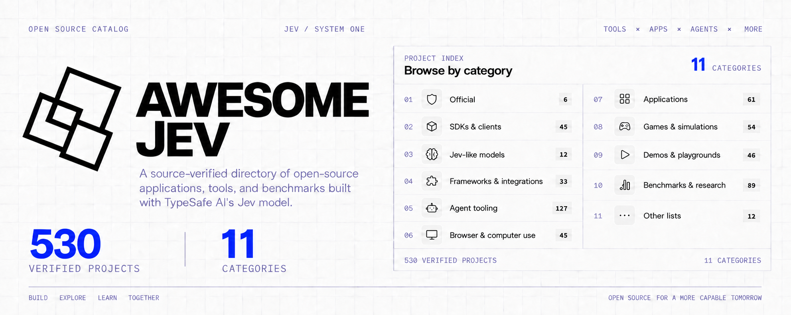

<p align="center">
  <a href="https://jevbest.com"></a>
</p>

<p align="center">
  
  
  
  <a href="LICENSE"></a>
</p>

<p align="center">
  <strong>English</strong> · <a href="README.zh-Hans.md">简体中文</a>
</p>

<p align="center">
  🌐 <a href="https://jevbest.com"><strong>Explore the website</strong></a>
  &nbsp;·&nbsp;
  ➕ <a href="https://github.com/heyjunpenn/awesome-jev/issues/new?title=%5BSubmission%5D%20"><strong>Submit a project</strong></a>
</p>

## About Awesome Jev

Awesome Jev is an independent, community-maintained catalog of **485 open-source projects** built with [Jev](https://typesafe.ai/), TypeSafe AI's System One model for typed decisions inside software. It is not affiliated with or endorsed by TypeSafe AI.

> **What makes this catalog useful?**
>
> Every entry identifies the concrete decision Jev makes and links to the strongest public evidence available—so you can evaluate real implementations, not just project claims.

## Contents

- ✅ [Official](#official-6) — **6**
- 📦 [SDKs & clients](#sdks--clients-42) — **42**
- 🧩 [Frameworks & integrations](#frameworks--integrations-28) — **28**
- 🤖 [Agent tooling](#agent-tooling-112) — **112**
- 🖥️ [Browser & computer use](#browser--computer-use-41) — **41**
- 🪟 [Applications](#applications-53) — **53**
- 🎮 [Games & simulations](#games--simulations-53) — **53**
- 🧪 [Demos & playgrounds](#demos--playgrounds-46) — **46**
- 📊 [Benchmarks & research](#benchmarks--research-92) — **92**
- 📚 [Other lists](#other-lists-12) — **12**

This README is a dated snapshot of **485 unique public GitHub repositories**. Stars were captured on **2026-09-18–20** for discovery, not ranking; verify current behavior, activity, and licensing upstream.

## Added today

<details open>
<summary><strong>52 projects added on September 20, 2026</strong></summary>

- **Official (2):** [TypeSafe Daggerverse](https://github.com/typesafe-ai/daggerverse), [TypeSafe Overwatch](https://github.com/typesafe-ai/Overwatch)
- **SDKs & clients (1):** [jev-cli](https://github.com/lhotwll217/jev-cli)
- **Frameworks & integrations (4):** [jevql](https://github.com/kylemclaren/jevql), [ground-zero](https://github.com/zavocc/ground-zero), [hiep-paseo-plugin](https://github.com/HiepPP/hiep-paseo-plugin), [jev-connector](https://github.com/adhamelhayek-lab/jev-connector)
- **Agent tooling (13):** [tenet](https://github.com/zoidsh/tenet), [jev-belay](https://github.com/valentynkit/jev-belay), [jev-commit](https://github.com/valentynkit/jev-commit), [pi-fast-jev-compaction](https://github.com/QuentinDanblon/pi-fast-jev-compaction), [jev-flash-router](https://github.com/Ravinder82/jev-flash-router), [pi-jev](https://github.com/iefnaf/pi-jev), [pi-jev-helm](https://github.com/Z761293629/pi-jev-helm), [stepwarden](https://github.com/getexcited/stepwarden), [AskJev-MCP](https://github.com/cbruyndoncx/AskJev-MCP), [jev-compaction](https://github.com/picaye/jev-compaction), [jev-plugins](https://github.com/Pinutss/jev-plugins), [jevkeep](https://github.com/hatt-io/jevkeep), [pi-jev-router](https://github.com/gloridifice/pi-jev-router)
- **Browser & computer use (6):** [jev-social](https://github.com/socai-io/jev-social), [jev-skip](https://github.com/valentynkit/jev-skip), [jevarena](https://github.com/raihankhan-rk/jevarena), [jev-browser-pilot](https://github.com/aidil2105/jev-browser-pilot), [jevlens](https://github.com/knowlet/jevlens), [jev-orb](https://github.com/bottlebrushes/jev-orb)
- **Applications (7):** [jev.nvim](https://github.com/valentynkit/jev.nvim), [github-star-organizer-jev](https://github.com/yutkat/github-star-organizer-jev), [jev](https://github.com/haibt163/jev), [JevSysUno](https://github.com/Dujaydis/JevSysUno), [jev-trader](https://github.com/renatosousa/jev-trader), [newsscore](https://github.com/mahynotch/newsscore), [trading-bot-jev](https://github.com/Spykoninho/trading-bot-jev)
- **Games & simulations (8):** [jev-plays-pokemon-red](https://github.com/valentynkit/jev-plays-pokemon-red), [jev-royal](https://github.com/Amrit-Nigam/jev-royal), [beat-jev](https://github.com/ojusave/beat-jev), [f1](https://github.com/MartinPuli/f1), [jev-atari-lab](https://github.com/memorysaver/jev-atari-lab), [jev-plays-pokemon](https://github.com/zbloss/jev-plays-pokemon), [JevArena](https://github.com/rolki-png/JevArena), [naimono-lab](https://github.com/mocchalera/naimono-lab)
- **Demos & playgrounds (2):** [forma-system1-experiment](https://github.com/LamplighterPaul/forma-system1-experiment), [tiny-jev](https://github.com/karimatayuta/tiny-jev)
- **Benchmarks & research (4):** [openjev](https://github.com/DECRUX9812/openjev), [paper-package](https://github.com/CompleteDotTech/paper-package), [jev-vs-luna](https://github.com/mameli/jev-vs-luna), [typed-decisions](https://github.com/kotoba-lang/typed-decisions)
- **Other lists (5):** [awesome-jev-by-typesafe](https://github.com/Anil-matcha/awesome-jev-by-typesafe), [awesome-jev](https://github.com/hellogumbo/awesome-jev), [awesome-jev-typesafe](https://github.com/valentynkit/awesome-jev-typesafe), [jevusecases](https://github.com/theSekyi/jevusecases), [Jev-Case](https://github.com/Hiwoniu/Jev-Case)

</details>

### Official (6)

| Project | Stars | Language | Description |
|---|---:|---|---|
| [TypeSafe agent skills](https://github.com/typesafe-ai/skills) | ★ 765 | — | Official agent skill for Claude Code, Codex, and compatible agents: primitives, patterns, and how to structure evaluations. |
| [TypeSafe JavaScript SDK](https://github.com/typesafe-ai/typesafe-sdk-js) | ★ 168 | TypeScript | Official TypeScript/JavaScript client with inferred answer types. npm install @typesafe-ai/sdk. |
| [System One adapter (Python)](https://github.com/typesafe-ai/system-one-adapter-python) | ★ 171 | Python | Official drop-in TypeSafeClient replacement backed by OpenAI, Anthropic, and compatible LLM APIs, for comparing Jev against chat models. |
| [TypeSafe Python SDK](https://github.com/typesafe-ai/typesafe-sdk-python) | ★ 128 | Python | Official sync and async Python client. pip install typesafe-sdk. |
| [TypeSafe Daggerverse](https://github.com/typesafe-ai/daggerverse) | ★ 12 | Python | Official collection of reusable Dagger modules for TypeSafe AI and System One workflows. |
| [TypeSafe Overwatch](https://github.com/typesafe-ai/Overwatch) | ★ 4 | Python | Official tooling for observing and evaluating System One workflows. |

### SDKs & clients (42)

| Project | Stars | Language | Description |
|---|---:|---|---|
| [advocaat](https://github.com/pithings/advocaat) | ★ 85 | TypeScript | A small, type-safe client for asking AI questions about your data, powered by TypeSafe Jev. |
| [jev (dannote)](https://github.com/dannote/jev) | ★ 17 | Elixir | TypeSafe Jev for OTP: reply to Jev from a GenServer and pattern match on its answer. |
| [typesafe-ai](https://github.com/Twister915/typesafe-ai) | ★ 10 | Rust | Typed TypeSafe AI clients for Rust, with async and blocking backends and observable retries. |
| [typesafe-sdk-go (Tangerg)](https://github.com/Tangerg/typesafe-sdk-go) | ★ 8 | Go | Go SDK for the TypeSafe AI API — typed questions in, probability distributions out. |
| [zod-jev](https://github.com/jomatsu/zod-jev) | ★ 7 | TypeScript | Zod validates the shape, Jev validates the meaning: semantic checks on request bodies become calibrated probabilities you threshold in code. |
| [super-jev](https://github.com/Kevthetech143/super-jev) | ★ 5 | Python | A small, extensible decision-to-action harness for TypeSafe Jev. |
| [typesafe-dotnet-sdk](https://github.com/saibimajdi/typesafeai-dotnet-sdk) | ★ 5 | C# | Community .NET SDK for the TypeSafe AI System One API — typed noul, choice, and score questions with structured, confidence-scored answers. Not affiliated with TypeSafe AI. |
| [jev-dsl](https://github.com/inanna-malick/jev-dsl) | ★ 6 | Haskell | Agent-first Haskell DSL for TypeSafe's Jev judgment model: typed packets, inferred types, answers under the same labels. |
| [typesafe-sdk (joshmn)](https://github.com/joshmn/typesafe-sdk) | ★ 4 | Ruby | Ruby client for typesafe.ai. |
| [jev-java](https://github.com/Olti1947/jev-java) | ★ 3 | Java | Idiomatic Java SDK for TypeSafe AI Jev System One decision engine. |
| [jod](https://github.com/mateonunez/jod) | ★ 3 | TypeScript | Semantic schemas over TypeSafe's Jev — validate the state locally, then project typed answers. |
| [typesafe-ai-rs](https://github.com/gilljon/typesafe-ai-rs) | ★ 3 | Rust | Independent async and blocking Rust SDK for the TypeSafe AI System One API. |
| [typesafe-go (cole-gillespie)](https://github.com/cole-gillespie/typesafe-go) | ★ 2 | Go | Unofficial go SDK for typesafe AI, with typed answers, retries, and context support. |
| [typesafe-sdk-java](https://github.com/Premo-Cloud/typesafe-sdk-java) | ★ 2 | Java | Community Java client for the TypeSafe System One API (unofficial). |
| [typesafe-sdk-swift (alterhq)](https://github.com/alterhq/typesafe-sdk-swift) | ★ 4 | Swift | Dependency-free Swift 6 client for Jev Choice, Score, and Noul questions, with strict concurrency, retries, and offline transport tests. |
| [typesafe-sdk-swift](https://github.com/InsaneArts/typesafe-sdk-swift) | ★ 3 | Swift | Swift SDK for TypeSafe AI. |
| [typesafe_sdk](https://github.com/nshkrdotcom/typesafe_sdk) | ★ 3 | Elixir | An idiomatic, type-safe Elixir port of the official TypeScript AI SDK (ai / ai-sdk) providing unified LLM integrations, streaming text and structured outputs, tool calling, and agentic workflows. Jev is their current flagship model and is the first System One model. |
| [TypeSafeAI.Net](https://github.com/Hawxy/TypeSafeAI.Net) | ★ 2 | C# | .NET SDK for the TypeSafe AI platform. |
| [zio-typesafe-ai](https://github.com/jamesward/zio-typesafe-ai) | ★ 3 | Scala | Scala 3 / ZIO client for the System One API: typed end-to-end, several questions per round-trip via NamedTuple. |
| [jev-go (Gaurav-Gosain)](https://github.com/Gaurav-Gosain/jev-go) | ★ 3 | Go | Go client for TypeSafe's System One API and its model Jev: typed judgments and calibrated probabilities instead of generated text. |
| [jev-go (guillemus)](https://github.com/guillemus/jev-go) | ★ 1 | Go | Unofficial Go SDK for TypeSafe AI's Jev API. |
| [jevclient](https://github.com/AboveColin/jevclient) | ★ 1 | Python | Async Python client for TypeSafe Jev. Typed questions in, probabilities and choices out, no prose to parse. |
| [jevgo](https://github.com/fgn/jevgo) | ★ 2 | Go | Go client for TypeSafe AI's System One API (Jev), with optional Langfuse instrumentation. |
| [typesafe-client](https://github.com/JedimEmO/typesafe-client) | ★ 1 | Rust | Unofficial typed async Rust client for the TypeSafe System One API. |
| [typesafe-sdk-rust](https://github.com/codeitlikemiley/typesafe-sdk-rust) | ★ 2 | Rust | Rust SDK for the TypeSafe AI API. |
| [typesafeai-go](https://github.com/chez-shanpu/typesafeai-go) | ★ 1 | Go | Go SDK for TypeSafe AI API https://docs.typesafe.ai/api. |
| [decido](https://github.com/yairshy/decido) | ★ 1 | Python | Probabilistic decisions for Python. Use Jev or bring your own provider; crawl with Playwright. |
| [jev](https://github.com/anilsenay/jev) | ★ 1 | Go | Unofficial Go client for TypeSafe's System One API and its model, Jev. |
| [kunobi-jev](https://github.com/kunobi-ninja/kunobi-jev) | ★ 0 | Rust | Rust client for the TypeSafe System One API (Jev). |
| [s1-rs](https://github.com/AbdelStark/s1-rs) | ★ 0 | Rust | Typed System One layer for Rust (Choice/Score/Noul). |
| [tinyjevclient](https://github.com/tinyhumansai/tinyjevclient) | ★ 0 | Rust | An integration with jev by typesafe.ai in Rust. |
| [typesafe](https://github.com/mattneel/typesafe) | ★ 0 | Elixir | An idiomatic Elixir client for the TypeSafe AI API. |
| [typesafe-go (zhirschtritt)](https://github.com/zhirschtritt/typesafe-go) | ★ 1 | Go | Idiomatic Go SDK for the TypeSafe AI API. |
| [typesafe-rs](https://github.com/AbdelStark/typesafe-rs) | ★ 0 | Rust | Latency-first Rust SDK for TypeSafe System One. |
| [typesafe-sdk (binnash)](https://github.com/binnash/typesafe-sdk) | ★ 1 | PHP | PHP & Laravel SDK for TypeSafe AI's JEV Model series. |
| [typesafe-sdk-go](https://github.com/valksor/typesafe-sdk-go) | ★ 0 | Go | Unofficial Go SDK for the TypeSafe AI System One API — 1:1 parity with the official JS and Python SDKs. Not affiliated with TypeSafe AI. |
| [typesafe-sdk-php](https://github.com/valksor/typesafe-sdk-php) | ★ 0 | PHP | Unofficial PHP SDK for the TypeSafe AI System One API — 1:1 parity with the official JS and Python SDKs. Not affiliated with TypeSafe AI. |
| [typesafe.zig](https://github.com/mattneel/typesafe.zig) | ★ 0 | Zig | An idiomatic Zig client for the TypeSafe AI API. |
| [typesafe_ai (hfiguera)](https://github.com/hfiguera/typesafe_ai) | ★ 0 | Elixir | A supervised Mint client for the TypeSafe AI System One API. |
| [typesafe_ai (typesend)](https://github.com/typesend/typesafe_ai) | ★ 0 | Elixir | Unofficial Elixir SDK for the TypeSafe AI API. |
| [typesafe_sdk_ex](https://github.com/vinnie357/typesafe_sdk_ex) | ★ 1 | Elixir | Typesafe AI SDK in Elixir using Req. |
| [jev-cli (lhotwll217)](https://github.com/lhotwll217/jev-cli) | ★ 0 | TypeScript | JSON-in, typed-decisions-out CLI for the TypeSafe System One API. |

### Frameworks & integrations (28)

| Project | Stars | Language | Description |
|---|---:|---|---|
| [eve](https://github.com/vercel/eve) | ★ 5,274 | TypeScript | Vercel's open agent framework, which ships Jev as the default evaluation model in its experimental evaluate path. |
| [ai-cli](https://github.com/vercel-labs/ai-cli) | ★ 807 | TypeScript | Vercel Labs terminal CLI that can run Jev as the evaluation model for its evaluate command. |
| [smithers](https://github.com/smithersai/smithers) | ★ 417 | TypeScript | Agentic TypeScript workflow framework with a Jev session checker wired into its workflows. |
| [pg-jev](https://github.com/realZachi/pg-jev) | ★ 224 | Python | Ask your Postgres tables questions in plain language. A PostgreSQL extension powered by TypeSafe's Jev. |
| [skillbox](https://github.com/kitze/skillbox) | ★ 200 | TypeScript | Self-hosted, versioned skills library for AI agents with optional Jev recommendations through TypeSafe or an AI gateway. |
| [jev-shell-history](https://github.com/mrnugget/jev-shell-history) | ★ 67 | TypeScript | Fish-style zsh history autosuggestions ranked by Jev (TypeSafe). |
| [Loki](https://github.com/wundercorp/loki) | ★ 26 | Python | Self-improving agent harness with an optional TypeSafe Jev companion for typed Choice, Score, and Noul judgments. |
| [neo4jev](https://github.com/jexp/neo4jev) | ★ 38 | Jupyter Notebook | Typesafe.ai System One Model Jev navigating a Neo4j graph by using a classifier over neighbouring relationships. |
| [ruby_llm-typesafe](https://github.com/kieranklaassen/ruby_llm-typesafe) | ★ 15 | Ruby | TypeSafe structured-output provider for RubyLLM 2. |
| [jevql](https://github.com/kylemclaren/jevql) | ★ 7 | Go | Adds `jev()`, `jev_prob`, `jev_choice`, and `jev_score` to vanilla PostgreSQL queries through a psql-shaped CLI and Go, TypeScript, and Python SDKs. |
| [HA-Jev](https://github.com/AboveColin/HA-Jev) | ★ 24 | Python | Home Assistant integration for TypeSafe Jev. Ask a question about your house and get a probability, a choice or a score as an entity. |
| [pg_typesafe](https://github.com/giuliosmall/pg_typesafe) | ★ 79 | C | Pre-alpha PostgreSQL extension for TypeSafe AI (Jev) categorical classification. |
| [a0-typesafe-ai](https://github.com/3clyp50/a0-typesafe-ai) | ★ 5 | Python | TypeSafe AI Jev judgments for Agent Zero, with typed tools and probability cards. |
| [typesafe-jev-workflow](https://github.com/GiesN/typesafe-jev-workflow) | ★ 5 | Python | Async LangGraph workflow that gets a typed Jev Choice (invoice or general) and routes each inbound email to the matching handler. |
| [typesafe-on-neon](https://github.com/andrelandgraf/safer-with-jev) | ★ 4 | TypeScript | Neon Function proxy for the Neon AI Gateway with TypeSafe Jev routing. |
| [laravel-typesafe-jev](https://github.com/Butochnikov/laravel-typesafe-jev) | ★ 2 | PHP | Unofficial Laravel integration for TypeSafe Jev AI with typed responses, async requests, scoped dependency injection, and testing fakes. |
| [llama-index-jev](https://github.com/WiktorB2004/llama-index-jev) | ★ 3 | Python | LlamaIndex reranker + router powered by TypeSafe Jev — typed scores/choices, cheaper than LLM-as-judge. |
| [judging-with-typesafe](https://github.com/carlsonchik/judging-with-typesafe) | ★ 1 | Python | Скилл для агентов Letta: суждения по критериям через TypeSafe System One (Jev). |
| [pydantic-jev-examples](https://github.com/adtyavrdhn/pydantic-jev-examples) | ★ 1 | Python | Pydantic AI capabilities made stronger with Jev: small runnable demos, one file each. |
| [typesafe-ai-rails](https://github.com/GenieRobot/typesafe-ai-rails) | ★ 2 | Ruby | Community Rails integration on the typesafe-sdk gem: configuration, persisted usage and cost telemetry, and opt-in confidence policies. |
| [typesafe-assist](https://github.com/JanOstrowka/typesafe-assist) | ★ 1 | Python | Home Assistant Assist conversation agent powered by TypeSafe's Jev (System One) model. |
| [Jev4Mellea](https://github.com/SoundBlaster/Jev4Mellea) | ★ 0 | Python | Jev adapter to Mellea. |
| [n8n-nodes-typesafe-ai](https://github.com/DomMonte/n8n-nodes-typesafe-ai) | ★ 0 | TypeScript | N8n community node for the TypeSafe AI System One API — typed yes/no, choice and score questions with calibrated probabilities. |
| [new-api-plugin-typesafe](https://github.com/FFatTiger/new-api-plugin-typesafe) | ★ 2 | JavaScript | TypeSafe AI System One task plugin for New API with a native `/v1/systemone` endpoint, routing, and token billing. |
| [typesafe-ui](https://github.com/BunsDev/typesafe-ui) | ★ 2 | TypeScript | Shadcn-style reusable components and blocks for using TypeSafe AI. |
| [ground-zero](https://github.com/zavocc/ground-zero) | ★ 0 | Python | Evaluation framework for detecting AI hallucinations and instruction-following failures with Jev. |
| [hiep-paseo-plugin](https://github.com/HiepPP/hiep-paseo-plugin) | ★ 0 | TypeScript | Local Paseo plugin that exposes Jev evaluations through MCP. |
| [jev-connector](https://github.com/adhamelhayek-lab/jev-connector) | ★ 0 | JavaScript | Connector for integrating TypeSafe Jev decisions into application workflows. |

### Agent tooling (112)

| Project | Stars | Language | Description |
|---|---:|---|---|
| [openwork](https://github.com/different-ai/openwork) | ★ 23,654 | TypeScript | Open-source Claude Cowork alternative whose eval testkit can use Jev as a typed verification judge for agent-produced work. |
| [fast-jev-compaction](https://github.com/tamaratran/fast-jev-compaction) | ★ 4,427 | TypeScript | Claude Code plugin that replaces the compaction summary with Jev decisions: every tool call and result is scored in one fast request, stale ones are dropped or truncated, everything kept stays verbatim. |
| [foreman](https://github.com/thruwire/foreman) | ★ 406 | Python | Software Factory Foreman: an agent supervisor that uses Jev decisions to keep coding agents on task. |
| [jev-review (devagrawal09)](https://github.com/devagrawal09/jev-review) | ★ 366 | TypeScript | A staged code-review workflow and local dashboard built with TypeSafe Jev. |
| [pi-jev (y0usaf)](https://github.com/y0usaf/pi-jev) | ★ 92 | TypeScript | TypeSafe Jev as a decision layer for the Pi coding agent: a measured tool-call gate plus jev_ask for typed, calibrated answers. |
| [jev-router (gargpratyush)](https://github.com/gargpratyush/jev-router) | ★ 214 | JavaScript | Route to the cheapest model in claude code for your task using jev-router. |
| [jev-review (NiazMorshed2007)](https://github.com/NiazMorshed2007/jev-review) | ★ 171 | TypeScript | Local-first MCP plugin for continuous software-quality review by AI coding agents, powered by Jev. |
| [building-with-jev-skill](https://github.com/dbreunig/building-with-jev-skill) | ★ 118 | — | A skill for writing and improving programs that call Jev, TypeSafe's System One model. |
| [jev-mcp (jkudish)](https://github.com/jkudish/jev-mcp) | ★ 121 | TypeScript | Proof of concept MCP for Typesafe's new Jev AI model. |
| [typesafe-mcp](https://github.com/itsmostafa/typesafe-mcp) | ★ 117 | Go | Go CLI and single-binary MCP server exposing TypeSafe judgments to Claude Desktop, Claude Code, and Codex. |
| [pi-warden](https://github.com/DevMortimer/pi-warden) | ★ 96 | TypeScript | Guardrails for Pi built on pi-typesafe that steer the agent instead of interrupting you: Jev judges irreversible and off-task tool calls, detects stuck loops, checks unverified done claims, flags slop. |
| [jev-search](https://github.com/superagents-lab/jev-search) | ★ 244 | TypeScript | Search the web with TypeSafe's Jev: source selection, query understanding and relevance ranking. Built with Search1API. |
| [skillranker](https://github.com/Dicklesworthstone/skillranker) | ★ 69 | Rust | Rust CLI powered by Jev from TypeSafe.ai that ranks agent skills for the next step using live session context. Includes Claude Code hooks, structured JSON, abstention, and local feedback. Requires a TypeSafe API key. |
| [duet-agent](https://github.com/dzhng/duet-agent) | ★ 43 | TypeScript | Full-stack agent harness with memories, long-running tasks, multi-agent relay, and a Jev-backed model-routing table. |
| [jev-codex-router](https://github.com/0xNatoshi/jev-codex-router) | ★ 75 | Python | Per-turn model & reasoning routing for Codex, driven by Jev (TypeSafe System One): picks the model, thinking depth and speed mode for every turn. |
| [ask-jev-skill](https://github.com/shantanugoel/ask-jev-skill) | ★ 34 | Python | Skill for Hermes, and other agents, to ask typesafe's jev. |
| [hono-jev-router](https://github.com/yusukebe/hono-jev-router) | ★ 39 | TypeScript | Route HTTP requests by meaning. A semantic router for Hono powered by Jev. |
| [winnow](https://github.com/GhalebDweikat/winnow) | ★ 26 | Python | A calibrated context sieve for Claude Code: every tool result is judged by a System One model before it enters context. |
| [jev-axi](https://github.com/shiftynick/jev-axi) | ★ 17 | TypeScript | Agent-ergonomic CLI for TypeSafe's Jev: fast calibrated judgments (pick, rate, check, rank, triage, guard) from the shell. |
| [yoshi](https://github.com/compozy/yoshi) | ★ 18 | TypeScript | Context-pruning proxy for Claude Code and Codex: Jev judges which history is still needed, measured not claimed. POC here now, heading soon into [Compozy](https://github.com/compozy/compozy). |
| [pi-jev-auto-mode](https://github.com/jomatsu/pi-jev-auto-mode) | ★ 17 | TypeScript | Jev (TypeSafe System One) backed auto mode for the Pi coding agent: semantically auto-approves bash, write, and edit tool calls and fails closed when a decision cannot be made. |
| [jev-mcp (blakestone-x)](https://github.com/blakestone-x/jev-mcp) | ★ 11 | Python | MCP server for TypeSafe Jev: typed classify, score, check, match and screen for any agent, with confidence on every answer. |
| [JevLint](https://github.com/huntedman/JevLint) | ★ 10 | TypeScript | Configurable semantic linting powered by Jev, with file-level NOUL judgments and a magic-strings plugin. |
| [jev-code](https://github.com/devagrawal09/jev-code) | ★ 75 | TypeScript | Bounded TypeSafe Jev workflows for coding agents. |
| [opencompany](https://github.com/useopencompany/opencompany) | ★ 6 | TypeScript | AI workspace whose approval review uses Jev to gate workspace actions with typed decisions. |
| [pi-jev (TheoOliveira)](https://github.com/TheoOliveira/pi-jev) | ★ 18 | TypeScript | Semantic tool routing and typed System One decisions for the Pi coding agent using TypeSafe Jev. |
| [pi-jev-router](https://github.com/mejiasd3v/pi-jev-router) | ★ 7 | JavaScript | Automatic model routing for Pi using TypeSafe's Jev through Vercel AI Gateway. |
| [snifftest](https://github.com/DanRWilloughby/snifftest) | ★ 22 | TypeScript | A prose linter that sniffs out AI writing tells. Zero dependencies, countable rules plus one judgment model. |
| [typesafe-skill-router](https://github.com/DECRUX9812/typesafe-skill-router) | ★ 8 | Python | TypeSafe (Jev) skill routing for Hermes Agent: names the one skill worth loading, before the model call. Opt-in, stdlib only, ~$0.001 per routed turn. |
| [jev-agent-skill-router](https://github.com/GodsBoy/jev-agent-skill-router) | ★ 8 | Python | Typed, confidence-aware agent skill routing with TypeSafe Jev. |
| [jev-mcp (arunav25)](https://github.com/arunav25/jev-mcp) | ★ 5 | JavaScript | Connect JEV to MCP clients and compare its judgments against general-purpose LLMs using shared datasets and measurable accuracy. |
| [JevRouter](https://github.com/BillionsBobby/JevRouter) | ★ 90 | TypeScript | A lightweight Jev-powered router for models, tools, and subagents. |
| [jevwire](https://github.com/Brainwires/jevwire) | ★ 10 | TypeScript | Jev decision layer for agents: MCP server, embeddable DecisionModel library, and an escalate-only Claude Code plugin (TypeSafe AI's Jev). |
| [clean-code-review](https://github.com/frostney/clean-code-review) | ★ 6 | TypeScript | Every code file in a pull request, judged against Uncle Bob's Clean Code by TypeSafe's Jev, then reviewed by Luna. Built on eve and Next.js. |
| [diffjury](https://github.com/raihankhan-rk/diffjury) | ★ 4 | TypeScript | DiffJury — TypeSafe Jev PR risk router + code review coach. |
| [hermes-jev](https://github.com/keeltrace/hermes-jev) | ★ 8 | Python | Typed System One decisions, ranking, verification, and an opt-in Hermes tool gate using TypeSafe Jev. |
| [hermes-jev-approvals](https://github.com/anpicasso/hermes-jev-approvals) | ★ 8 | Python | PoC: TypeSafe Jev as the reviewer for Hermes Agent smart command approvals. 8.7x faster, 4.4x fewer prompts, measured on 153 real commands. Approvals only. |
| [jev (BorisLeMeec)](https://github.com/BorisLeMeec/jev) | ★ 10 | Go | A claude code plugin for jev. |
| [jevex](https://github.com/jvsteiner/jevex) | ★ 3 | Python | Minimal agent loop where Jev directs control flow and a LangChain chat model writes argument values and the final response. |
| [pi-quiet-ask](https://github.com/HyunjunJeon/pi-quiet-ask) | ★ 8 | TypeScript | TypeSafe Jev as the pi coding agent's quiet decision layer. |
| [riff](https://github.com/scale-venture-partners/riff) | ★ 5 | Python | A small, fast prose linter: ruff-style rule codes for writing, backed by TypeSafe's Jev model. |
| [slidepilot](https://github.com/harshil1712/slidepilot) | ★ 4 | TypeScript | Voice-driven semantic auto-advance for Slidev, powered by Cloudflare Agents and TypeSafe AI Jev. |
| [typesafe-cli (geilt)](https://github.com/geilt/typesafe-cli) | ★ 3 | Python | CLI and agent skill for TypeSafe System One (Jev): typed Choice, Score, and Noul judgments. |
| [ailerix](https://github.com/tylerjharden/ailerix) | ★ 2 | TypeScript | Type-safe model router. Jev (System One) banks each request to a typed catalog route. |
| [bicameral](https://github.com/AbdelStark/bicameral) | ★ 4 | TypeScript | Hybrid coding harness: System 2 writes, System 1 (Jev) runs reflexes. |
| [fast-dev-compaction](https://github.com/leonaaardob/fast-dev-compaction) | ★ 3 | TypeScript | Codex plugin: verbatim Jev-guided context restoration around session compaction. Port of tamaratran/fast-jev-compaction to Codex lifecycle hooks. |
| [jcm-router](https://github.com/adarshmishra07/jcm-router) | ★ 2 | TypeScript | Local proxy that picks the Claude model and effort per message using TypeSafe Jev. Routes subagents, leaves your cached main chat alone. |
| [jev-guard](https://github.com/leepokai/jev-guard) | ★ 10 | JavaScript | Prompt-injection and dangerous-action guard for coding agents (Claude Code, Codex, pi, ACP), powered by Jev. |
| [jev-judgment](https://github.com/HyunjunJeon/jev-judgment) | ★ 3 | Python | Agent Skill: send closed coding-agent judgments to TypeSafe Jev. |
| [jev-mcp (rashedInt32)](https://github.com/rashedInt32/jev-mcp) | ★ 3 | TypeScript | MCP server exposing TypeSafe Jev as typed, calibrated judgment tools: classify, score, check, batched ask. Ships as a Claude Code plugin. |
| [jev-shield](https://github.com/caiovicentino/jev-shield) | ★ 2 | JavaScript | Semantic MCP firewall powered by Jev — screens every tool call, tool result, and tool description with calibrated System One verification. 94% block recall, 0 false positives, ~$0.00002/check. |
| [jev-seo](https://github.com/AkashPriyadarshii/jev-seo) | ★ 11 | Rust | Agent-first SEO and GEO CLI suite and MCP server using DuckDuckGo evidence and Jev scoring. |
| [jev-skill-gate](https://github.com/ShivamPansuriya/jev-skill-gate) | ★ 2 | JavaScript | Cut Claude Code's skill manifest by ~75% with TypeSafe Jev. Scores every installed skill for relevance and hides the rest via skillOverrides — 12,750 → 3,185 tokens on a 217-skill install, for $0.0009 a session. |
| [jev-system-architect](https://github.com/samtay32/jev-system-architect) | ★ 2 | — | System-architecture skill for TypeSafe AI Jev/System One — find fuzzy semantic judgment and turn it into small Choice/Score/Noul primitives. |
| [jev-workbench](https://github.com/molis-ai/jev-workbench) | ★ 2 | TypeScript | Build versioned judgment functions on TypeSafe's Jev once, then call the same published version from your backend over HTTP and from coding agents over MCP. The vendor key stays on your machine. |
| [jgrep](https://github.com/keltokhy/jgrep) | ★ 12 | Python | Grep, but the pattern is a description. Filters lines by meaning with TypeSafe's Jev decision model: ~200 ms and a thousandth of a cent per line. |
| [omp-jev-compaction](https://github.com/jerryfane/omp-jev-compaction) | ★ 7 | TypeScript | Verbatim Jev-scored context reduction for omp, over TypeSafe or OpenRouter. |
| [pi-fast-jev-compaction](https://github.com/joelhooks/pi-fast-jev-compaction) | ★ 5 | TypeScript | Pi extension: verbatim context compaction with TypeSafe Jev decisions. |
| [pi-heed](https://github.com/Nyarlathoteppppp/pi-heed) | ★ 3 | TypeScript | Runtime constraints for the pi coding agent: checks every side-effecting tool call against what you said, before it runs. Powered by TypeSafe Jev. |
| [skill-router](https://github.com/lomeshdutta/skill-router) | ★ 2 | Python | Tell Claude Code which installed skill a session needs, using Jev (TypeSafe AI) for the decision and skills.sh for discovery. |
| [tiershift](https://github.com/iamvatsalpatel/tiershift) | ★ 2 | TypeScript | Shift every LLM call to the cheapest model that can handle it. Routing decided by TypeSafe Jev in ~180 ms. No training data. Policy in plain YAML. TypeScript and Python. |
| [todo-jev](https://github.com/maker-KK/todo-jev) | ★ 2 | Python | ⚡ Ultra-fast, low-cost intelligent task classifier and 3-tier routing engine powered by TypeSafe Jev (System One). |
| [typesafe-migration-guard](https://github.com/opaielsheikh/typesafe-migration-guard) | ★ 2 | TypeScript | Automated database migration safety reviewer powered by TypeSafe AI (Jev System One model). |
| [typesafe-mod](https://github.com/BeLazy167/typesafe-mod) | ★ 2 | TypeScript | Claude Code mod that routes decisions to TypeSafe's Jev model: ranks installed skills per prompt, and answers the agent's own this-or-that questions when confident. |
| [abide](https://github.com/coldteadotai/abide) | ★ 169 | TypeScript | Supervises coding-agent edits and uses Jev to flag violations of project rules. |
| [Antigravity-mcp-semantic-search-with-TypeSafeAi](https://github.com/greenyamao/Antigravity-mcp-semantic-search-with-TypeSafeAi) | ★ 1 | Python | Fast semantic code search & diff sanity auditor for AI coding assistants (Antigravity, Cursor, Claude Code) powered by TypeSafe System One. |
| [ask-jev](https://github.com/omni-/ask-jev) | ★ 1 | PowerShell | Utilizing Jev, the RLCD-type model provided by TypeSafe AI, to independently and cheaply judge agentic coding sessions. |
| [is-malicious](https://github.com/luantak/is-malicious) | ★ 14 | TypeScript | Scans a codebase for covert, deceptive, or data-stealing behavior with Jev, then reports suspicious files and line ranges before the user runs it. |
| [jev-cli (Nasrallah-AL)](https://github.com/Nasrallah-AL/jev-cli) | ★ 11 | TypeScript | Command-line tool for TypeSafe's Jev AI model. |
| [jev-mcp (burnigtm)](https://github.com/burnigtm/jev-mcp) | ★ 19 | TypeScript | MCP server that puts TypeSafe Jev on the coding loop in Cursor, Codex, and any MCP client. |
| [jev-predict-skill](https://github.com/DanielKillenberger/jev-predict-skill) | ★ 1 | HTML | Predict another skill's next closed decision with TypeSafe Jev — without running that skill. |
| [jev-router (prismhq)](https://github.com/prismhq/jev-router) | ★ 3 | Python | Open-source LLM router that uses TypeSafe's Jev to pick a model, on top of LiteLLM. |
| [jev-scout](https://github.com/AkashPriyadarshii/jev-scout) | ★ 1 | Rust | Grounded GitHub and crates.io discovery CLI and MCP server that uses Jev to score architectural fit, licensing, and maintenance. |
| [jev-skillful](https://github.com/bestagentkits/jev-skillful) | ★ 1 | TypeScript | Per-prompt capability router for coding agents: resolves installed skills, MCP servers, agents and commands against your prompt via TypeSafe Jev, and measures whether the injection actually helps. |
| [limpet](https://github.com/noplan-inc/limpet) | ★ 1 | Python | A Stop hook that stops your coding agent from stopping too early. Plain-language rules, judged by jev. |
| [omp-typesafe](https://github.com/siddicky/omp-typesafe) | ★ 1 | TypeScript | TypeSafe AI (Jev) adversarial reviewer and typesafe_ask tool for the omp coding agent. |
| [Augustus](https://github.com/24601/Augustus) | ★ 3 | Python | Agent skill for designing Jev-assisted systems with decision theory, composition patterns, question diagnostics, and validation gates. |
| [agent-gate-loop](https://github.com/Ripwords/agent-gate-loop) | ★ 0 | TypeScript | Reusable GitHub Action: agent fix loop gated by checks, an AI reviewer, and TypeSafe Jev. |
| [agent-handoff-gate](https://github.com/zsoXi/agent-handoff-gate) | ★ 0 | Python | Experimental protocol for evidence-aware agent handoffs, with Jev-assisted review before results reach the lead agent. |
| [check-risk](https://github.com/moezubair/check-risk) | ★ 0 | TypeScript | A CLI and GitHub Action that assesses code-change risk using deterministic rules and TypeSafe Jev, recommending checks and reviewers before merge. |
| [decide-mcp](https://github.com/dakdevs/decide-mcp) | ★ 0 | TypeScript | Configurable decision MCP server with AI SDK, Jev, percentage scores, and bias-profile routing. |
| [frost](https://github.com/marcus/frost) | ★ 0 | Go | A flexible and configurable CLI model router using TypeSafe Jev. |
| [hermes-jev-router](https://github.com/ussyverse/hermes-jev-router) | ★ 0 | Python | Experimental Hermes plugin: Jev-assisted model routing plans with budget and capability constraints. API access pending. |
| [jev-builder-loop](https://github.com/rainbowpuffpuff/jev-builder-loop) | ★ 0 | Python | Grok skill: Jev as a judgment sensor in a builder-agent loop (priors × probabilities → next act). |
| [jev-git](https://github.com/AkashPriyadarshii/jev-git) | ★ 1 | Rust | Sub-second pre-commit and pre-push semantic gate that screens staged diffs with Jev. |
| [jev-review (thiago-ss)](https://github.com/thiago-ss/jev-review) | ★ 0 | Python | Autonomous Jev pull-request review with typed decisions, calibrated approval gates, and trusted-owner escalation. |
| [jev-superpowers](https://github.com/AkashPriyadarshii/jev-superpowers) | ★ 4 | Shell | Cross-agent software-development skills that add Jev decisions to planning, execution, debugging, and completion gates. |
| [jev-triage](https://github.com/cephalization/jev-triage) | ★ 1 | TypeScript | Uses typeful jev, zero sync to pull and sync large repositories for issue triage. |
| [hunch](https://github.com/Kelbie/hunch) | ★ 1 | Python | Semantic code review with Jev, plain-English rules, and installable agent skills. |
| [mastra-jev-moderation](https://github.com/CodeAlive-AI/mastra-jev-moderation) | ★ 2 | TypeScript | Mastra input processor that uses Jev for a typed block decision and moderation category. |
| [omp-jevens-classifier](https://github.com/STRML/omp-jevens-classifier) | ★ 0 | TypeScript | Jev-powered model-judged permission gate for OMP (TypeSafe System One). |
| [pi-agent-foreman](https://github.com/alexshpunt/pi-agent-foreman) | ★ 0 | TypeScript | Send Pi agents back to work when they stop before the job is done. |
| [pi-jev-code](https://github.com/KamilPostrozny/pi-jev-code) | ★ 0 | TypeScript | Single-agent Pi coding coprocessor with Jev semantic gates, baseline-to-current diff review, and append-only observability telemetry. |
| [pi-typesafe](https://github.com/twilwa/pi-typesafe) | ★ 0 | TypeScript | Pi coding-agent extension built on the TypeSafe AI System One API (Jev). |
| [pi-typesafe-jev](https://github.com/legacybridge-tech/pi-typesafe-jev) | ★ 0 | TypeScript | A pi extension that exposes TypeSafe (Jev, System One) judgments as five pi tools, so a model can make narrow semantic judgments while your code and your users keep control of thresholds, weights, and actions. |
| [switchboard](https://github.com/aniruddh-krovvidi/switchboard) | ★ 0 | Python | Guardrail + model router for LLM gateways on TypeSafe's Jev (System One model), with an independent accuracy/calibration/latency evaluation. Stdlib Python. |
| [typesafe-demo-mcp](https://github.com/bestagentkits/typesafe-demo-mcp) | ★ 0 | TypeScript | MCP server exposing TypeSafe System One judgments (noul, choice, score) as agent tools. |
| [typesafeai-review](https://github.com/rbalch/typesafeai-review) | ★ 0 | Python | Using Typesafe.AI to generate diff reviews. |
| [zcode-jev](https://github.com/Zahrannnn/zcode-jev) | ★ 0 | TypeScript | Typed judgment layer for coding agents — gates from PRD to ship. Jev-ready, provider-agnostic. |

| [tenet](https://github.com/zoidsh/tenet) | ★ 4 | Go | Commit-time review gate where Jev judges plain-language rules against agent-written code. |
| [jev-belay](https://github.com/valentynkit/jev-belay) | ★ 9 | JavaScript | Claude Code Stop hook that asks four Jev questions when files changed without a passing check, blocking unverified completion claims while failing open on errors. |
| [jev-commit](https://github.com/valentynkit/jev-commit) | ★ 5 | Python | Pre-commit hook where Jev checks the message against the staged diff and flags debug leftovers, unmentioned work, and added credentials. |
| [pi-fast-jev-compaction (QuentinDanblon)](https://github.com/QuentinDanblon/pi-fast-jev-compaction) | ★ 2 | TypeScript | Pi context pruning that uses Jev to drop or truncate stale tool calls while preserving retained content verbatim. |
| [jev-flash-router](https://github.com/Ravinder82/jev-flash-router) | ★ 1 | TypeScript | MCP server that uses Jev to route coding-agent decisions such as file selection, task paths, and test-impact checks. |
| [pi-jev](https://github.com/iefnaf/pi-jev) | ★ 1 | TypeScript | Pi extension suite for Jev-powered context compaction and model routing. |
| [pi-jev-helm](https://github.com/Z761293629/pi-jev-helm) | ★ 1 | TypeScript | Pi extension that classifies tasks with Jev and routes each run to an explicitly configured model. |
| [stepwarden](https://github.com/getexcited/stepwarden) | ★ 1 | TypeScript | Claude Code plugin that has Jev compare each pending tool call with the session plan before allowing, escalating, or blocking it. |
| [AskJev-MCP](https://github.com/cbruyndoncx/AskJev-MCP) | ★ 0 | JavaScript | MCP server for typed Jev Choice, Noul, and Score judgments with probabilities and confidence. |
| [jev-compaction (picaye)](https://github.com/picaye/jev-compaction) | ★ 0 | JavaScript | Hermes context compaction that has Jev score tool calls, drops stale content, and preserves everything retained verbatim. |
| [jev-plugins](https://github.com/Pinutss/jev-plugins) | ★ 0 | — | Cursor and Hermes plugin marketplace for JEV Labs routing tools. |
| [jevkeep](https://github.com/hatt-io/jevkeep) | ★ 0 | TypeScript | Codex plugin that uses Jev to preserve useful conversation excerpts alongside compacted summaries. |
| [pi-jev-router (gloridifice)](https://github.com/gloridifice/pi-jev-router) | ★ 0 | TypeScript | Jev model-routing integration for the Pi coding agent. |

### Browser & computer use (41)

| Project | Stars | Language | Description |
|---|---:|---|---|
| [Jev Ultrafast](https://github.com/browser-use/jev-ultrafast) | ★ 9,291 | Python | Browser Use's ultrafast agent: Jev picks the operation and DOM element in one request; a small LLM only writes text when typing is needed. |
| [typesafe-computer-use](https://github.com/awlevin/typesafe-computer-use) | ★ 537 | Python | Computer use for about $0.0002 a step: OCR the screen, classify the next action with TypeSafe, click. macOS. |
| [mobile-jev](https://github.com/droidrun/mobile-jev) | ★ 240 | JavaScript | Standalone Android agent for Mobilerun where Jev makes every decision, with a live React studio and an Uber demo. |
| [jev-browser](https://github.com/jkudish/jev-browser) | ★ 155 | TypeScript | Browser use using Typesafe's Jev model. |
| [unclutter](https://github.com/kitze/unclutter) | ★ 136 | TypeScript | WXT browser extension: Jev-powered page clutter removal with reusable template rules. |
| [typesafe-adblock](https://github.com/realZachi/typesafe-adblock) | ★ 58 | JavaScript | 🧹 Fun project: a Chrome extension that asks a tiny AI decision model (TypeSafe Jev) "is this DOM element an ad?" and pops it off the page. BYOK, no backend, not a real ad blocker. |
| [jev-browser-use](https://github.com/wy-coliney/jev-browser-use) | ★ 206 | JavaScript | 5–10x faster browser operations: Jev clicks, Codex thinks and verifies. Built at EZCollegeApp. |
| [jev-voice-browser](https://github.com/moritzkremb/jev-voice-browser) | ★ 126 | JavaScript | Control a real browser by voice. Jev (TypeSafe System One) decides intent + target in ~300 ms per spoken word; Playwright acts — often before you finish the sentence. |
| [Jevbridge](https://github.com/gamesonrblx/Jevbridge) | ★ 25 | TypeScript | ACP and MCP adapter that bridges TypeSafe Jev with any LLM — computer use and typed decisions alongside Codex, Claude, Grok, and OpenCode. |
| [vibecheck](https://github.com/RafalWilinski/vibecheck) | ★ 42 | JavaScript | Chrome extension: vibe-check your X posts with TypeSafe's Jev before you hit Post. |
| [jev-browser (Ying-Kai-Liao)](https://github.com/Ying-Kai-Liao/jev-browser) | ★ 22 | JavaScript | Browser automation where an LLM plans and Jev (Typesafe System One) decides. Library, CLI and MCP server. |
| [jev-social](https://github.com/socai-io/jev-social) | ★ 10 | JavaScript | Social research agent for Instagram, TikTok, and LinkedIn: Jev repeatedly chooses the next concrete operation and target, while socai executes it in a local Chrome session. |
| [xtags](https://github.com/manifoldor/xtags) | ★ 8 | JavaScript | 在 X 的时间线上，给每条帖子标出它想让你干什么。判断来自 Jev，一个只返回概率、不生成文本的模型。 |
| [jev-browser (vinilana)](https://github.com/vinilana/jev-browser) | ★ 4 | TypeScript | Hybrid browser harness: an LLM turns goals into verifiable subgoals, Jev chooses each action and DOM field, Playwright acts. |
| [live-jev](https://github.com/vinilana/live-jev) | ★ 10 | JavaScript | 2D autonomous car simulation in the browser, driven by TypeSafe's Jev decision model. |
| [AskJev](https://github.com/ranjan2829/AskJev) | ★ 6 | TypeScript | AskJev — Jev autopilot for any website + guard on irreversible clicks (TypeSafe System One, not Claude). |
| [computer_use](https://github.com/paulsmith/computer-use-jev) | ★ 3 | Go | MacOS computer use driven by Jev (TypeSafe System One) as the decision maker. |
| [jev-browser (tontoko)](https://github.com/tontoko/jev-browser) | ★ 2 | JavaScript | One grounded Jev/Playwright core: typed SDK, persistent CLI, and MCP server with native browser operations and deterministic assertions. |
| [jev-ego](https://github.com/romaluev/jev-ego) | ★ 7 | TypeScript | TypeScript browser agent for ego lite: Jev Ultrafast indexed actions, TypeSafe Jev decisions, persistent observe/act CLI. No Chrome or Playwright. |
| [jev-frontend-qa](https://github.com/Nainish-Rai/jev-frontend-qa) | ★ 2 | Python | Evidence-driven frontend QA built on Jev Ultrafast and Browser Harness, with a synthetic todo demo. |
| [jev-shield (vmendes90)](https://github.com/vmendes90/jev-shield) | ★ 2 | TypeScript | Privacy-first Chrome extension that semantically blocks native ads, sponsored feed cards, and video ads using TypeSafe Jev. |
| [almond-fastloop](https://github.com/eriestra/almond-fastloop) | ★ 1 | HTML | Almond-fastloop: Almond's browser computer-use rig (Chrome DevTools + TypeSafe Jev), and the Browser Use Olympics benchmark it is measured on. |
| [barrunto](https://github.com/elpumberto/barrunto) | ★ 1 | TypeScript | A Chrome extension that brings TypeSafe's Jev to X.com to analyze posts as you browse. |
| [jev-browse](https://github.com/kyrylosyzonenko/jev-browse) | ★ 3 | JavaScript | Drives a real browser with Jev making every decision and Vercel's agent-browser performing every action, with a benchmark. |
| [otto](https://github.com/NobleSpartan6/otto) | ★ 2 | TypeScript | Open-source native computer use for macOS and Windows: TypeSafe Jev, local OCR, and selective planning. |
| [psearch](https://github.com/komikat/psearch) | ★ 1 | Python | Parallel web search for terminals and agents, with local Chromium and Jev-guided exploration. |
| [browser-use-olympics](https://github.com/eriestra/browser-use-olympics) | ★ 0 | HTML | Browser Use Olympics by Almond: one prompt, five events, one clock. Plus fast loop, a ~200-line browser computer-use agent (Chrome DevTools + TypeSafe Jev). |
| [jev-browser (KesavanKing)](https://github.com/KesavanKing/jev-browser) | ★ 0 | Python | Local browser automation UI that uses TypeSafe Jev to choose bounded page actions and a text model only for field values. |
| [jev-browser (MahmoudAdelbghany)](https://github.com/MahmoudAdelbghany/jev-browser) | ★ 0 | JavaScript | Jev-powered browser MCP for LLM agents — ~300ms decisions, no LLM tokens in the loop. Benchmark vs Playwright MCP included. |
| [jev-mobile](https://github.com/Friedjof/jev-mobile) | ★ 2 | Python | Fast structured Android control loops with TypeSafe Jev and Mobile MCP. |
| [jev-playwright-mcp](https://github.com/krw82/jev-playwright-mcp) | ★ 0 | TypeScript | Jev-augmented Playwright MCP proxy — page-state triage, prompt-injection shielding, goal-based snapshot pruning, risky-action gating. Drop-in wrapper around @playwright/mcp for any coding agent. |
| [JevTest](https://github.com/CorieW/JevTest) | ★ 0 | TypeScript | Bounded exploratory browser testing with Jev, deterministic assertions, and replayable evidence. |
| [sift](https://github.com/tylergibbs1/sift) | ★ 0 | TypeScript | Chrome extension that re-ranks Google results with TypeSafe Jev and folds away sales pages and SEO filler. |
| [sloppy-jevs-extension](https://github.com/neddes/sloppy-jevs-extension) | ★ 0 | JavaScript | Open-source Chrome extension that filters AI-generated prose and ads with Jev. |
| [turbo](https://github.com/sightmap/jev-turbo) | ★ 2 | Go | Jev-powered semantic browser use. |
| [fastbrowse](https://github.com/agent-labs-dev/fastbrowse) | ★ 5 | Python | Browser agent where Jev selects actions, an LLM reads and plans, and answers cite page evidence. |

| [jev-skip](https://github.com/valentynkit/jev-skip) | ★ 3 | TypeScript | YouTube extension that asks Jev for the sponsor probability of each caption segment and paints the result on the seek bar without a crowd database. |
| [jevarena](https://github.com/raihankhan-rk/jevarena) | ★ 2 | TypeScript | Two Jev agents compete in click-only browser games through Browser Use. |
| [jev-browser-pilot](https://github.com/aidil2105/jev-browser-pilot) | ★ 0 | Python | Bounded browser and desktop automation where Jev picks one next step while code owns perception, execution, and verification. |
| [jevlens](https://github.com/knowlet/jevlens) | ★ 0 | JavaScript | Chrome extension that uses Jev to annotate articles and posts on X and Threads. |
| [jev-orb](https://github.com/bottlebrushes/jev-orb) | ★ 0 | Makefile | Push-to-talk voice orb for autonomous browser control using Jev and Metal Whisper. |

### Applications (53)

| Project | Stars | Language | Description |
|---|---:|---|---|
| [jev-trader](https://github.com/jarrodwatts/jev-trader) | ★ 1,349 | TypeScript | One AI trade decision every Monad block. Jev on Kuru MON-USDC. |
| [notra](https://github.com/usenotra/notra) | ★ 191 | TypeScript | Marketing analytics platform whose feature flag routes brand-visibility classifiers off an LLM and onto Jev boolean decisions. |
| [jevmeter](https://github.com/ChetasLua/jevmeter) | ★ 70 | Python | Put a live Jev (TypeSafe) meter on any video: every sentence scored, rendered as a 16:9 edit. |
| [Jev-Moderation-Bot](https://github.com/brainstormity/Jev-Moderation-Bot) | ★ 36 | Python | Real-time Discord moderation bot: Jev evaluates messages and metadata in parallel to catch phishing, spam, and social engineering with a progressive escalation ladder. |
| [commit-miner](https://github.com/devanshbatham/commit-miner) | ★ 26 | Rust | Classify Git commit diffs and messages with Jev. Bug fixes, security fixes/CWEs, and change types. |
| [blink](https://github.com/ellipsis-dev/blink) | ★ 24 | TypeScript | Codebase search powered by Jev from @typesafe-ai. |
| [Jev-Trades](https://github.com/zadescoxp/Jev-Trades) | ★ 13 | Python | Trading bot with the all new TypeSafe AI's first system one model named as Jev. |
| [jevlogs](https://github.com/reachjalil/jevlogs) | ★ 8 | TypeScript | Open-source Jev log triage for OpenTelemetry. Score the signal before expensive LLM analysis. |
| [secondlayer](https://github.com/ryanwaits/secondlayer) | ★ 6 | TypeScript | Self-hosted Stacks data service whose Slack gate and fault-triage paths use Jev decisions. |
| [ai-elo-ranker](https://github.com/opaielsheikh/ai-elo-ranker) | ★ 5 | Python | High-speed recursive AI Elo tournament engine powered by Jev and Swiss matchmaking. |
| [semdecide](https://github.com/sharziki/semdecide) | ★ 6 | Python | Typed semantic decisions for Unix pipelines and CI, powered by TypeSafe AI Jev. |
| [refgarden](https://github.com/AlbionaHoti/refgarden) | ★ 23 | TypeScript | A spatial reference explorer for creators. Local Jev query choices, metadata highlights and source-linked collections. |
| [typesafe-cli (y0usaf)](https://github.com/y0usaf/typesafe-cli) | ★ 4 | TypeScript | Ask Jev typed questions from the shell: noul, choice, and score answers as numbers, not prose. |
| [jev-grug](https://github.com/mkotlikov/jev-grug) | ★ 4 | TypeScript | Helping JEV speak <3. |
| [jev-trade](https://github.com/aowang-ai/jev-trade) | ★ 29 | TypeScript | Live Jev trader on Hyperliquid. |
| [every](https://github.com/sufianetaouil/every) | ★ 3 | Python | Ask a yes/no question of every function in a codebase. Ranked answers in seconds, for cents. Grep whose pattern is a question, powered by TypeSafe Jev. |
| [jev-cli (tumf)](https://github.com/tumf/jev-cli) | ★ 6 | Python | Small dependency-free CLI for TypeSafe Jev. |
| [jev-tree](https://github.com/reachjalil/jev-tree) | ★ 2 | TypeScript | Recursive Jev choice over a taxonomy. Select from more than 255 options without breaking TypeSafe Jev's choice cap. |
| [jevibe-check](https://github.com/sriganesh/jevibe-check) | ★ 2 | JavaScript | A live tone labeler for Bluesky posts and drafts, using TypeSafe's Jev API. |
| [jevocks](https://github.com/unicodeveloper/jevocks) | ★ 9 | TypeScript | Everyday Stocks Status with Jev. |
| [jevsql](https://github.com/EugeneBoondock/jevsql) | ★ 3 | JavaScript | SQL with natural-language predicates, powered by TypeSafe's Jev. Filter, rank, classify and score rows by meaning — batched, cached and cost-guarded. |
| [smart-switch](https://github.com/reycn/smart-switch) | ★ 3 | Swift | Reimagined window switcher for macOS using frontier artificial intelligence. Predicted by TypeSafe's Jev model. |
| [btc-jev-signal](https://github.com/WebGrga/btc-jev-signal) | ★ 2 | TypeScript | Experimental multi-horizon BTC signal generator using TypeSafe Jev probabilities and Binance market data. |
| [commentcop](https://github.com/ntedvs/commentcop) | ★ 1 | TypeScript | Put your code comments on trial. Powered by Jev. |
| [Jackalope](https://github.com/Jackalope-Dev/jackalope) | ★ 1 | Rust | Desktop GUI for agentic coding that routes tasks across local agents and accounts, with Jev picking the best agent per task, running basic code-review checks, and supplying context. |
| [jev-cli](https://github.com/jtsang4/jev-cli) | ★ 1 | TypeScript | CLI for TypeSafe AI's Jev evaluation model — typed questions in, structured JSON answers out. |
| [jev-rerank](https://github.com/hev/reranker) | ★ 6 | Python | Use Jev (TypeSafe's System One model) as a calibrated reranker: one call, up to 30 documents, a probability per document. Apache-2.0. |
| [pagegrade](https://github.com/kitze/pagegrade) | ★ 1 | TypeScript | Browser extension that grades page sections for clarity, writing quality, and on-page SEO with Jev. |
| [qualm](https://github.com/qddegtya/qualm) | ★ 1 | TypeScript | Typed decisions from a System One model. An uncertain answer is a different type from a confident one — and the compiler makes you handle it. |
| [typesafe-jev](https://github.com/gtaras7/typesafe-jev) | ★ 2 | TypeScript | Screen a folder of CVs with the TypeSafe Jev decision model: typed judgments, an editable policy, free re-scoring. |
| [citation-verifier](https://github.com/MarissaFamularo/citation-verifier) | ★ 2 | JavaScript | Check whether each cited paper supports the sentence citing it. Claude proves the quote, TypeSafe's Jev scores it, a human decides. |
| [draftpulse](https://github.com/pekth/draftpulse) | ★ 0 | TypeScript | Experimental: live X draft viral scorer powered by TypeSafe Jev. |
| [emoji-jev](https://github.com/colinmcdermott/emoji-jev) | ★ 0 | TypeScript | Emoji autocomplete at the speed of typing. TypeSafe AI Jev on a Whop-hosted TanStack Start app. |
| [jev-audio-beeper](https://github.com/santos-sanz/jev-audio-beeper) | ★ 1 | TypeScript | Low-latency audio censorship POC using Jev typed decisions and ffmpeg. |
| [jev-document-classification](https://github.com/Charlyhno-eng/jev-document-classification) | ★ 2 | TypeScript | JEV Document Classification enables the rapid and cost-effective classification of text-based documents using AI, leveraging TypeSafe's "System One" model. |
| [jev-resume-analyzer](https://github.com/awun8191/jev-resume-analyzer) | ★ 0 | Python | CV diagnostics and job alignment with TypeSafe Jev, React and FastAPI. |
| [JevSlop](https://github.com/TKY-27/JevSlop) | ★ 0 | TypeScript | Scores public note.com articles across eight Jev dimensions and produces an inspectable AI-slop score. |
| [jevegis](https://github.com/0xArx/jevegis) | ★ 0 | TypeScript | Guardrails for LLM apps in one API call. Prompt injection, jailbreaks, leaks, unsafe content. Built on TypeSafe Jev. MIT. |
| [JevTicktRouter](https://github.com/GhrezaKh74/JevTicktRouter) | ★ 1 | C# | A .NET 10 and React 19 application for fast, structured AI-powered ticket triage using TypeSafe Jev. |
| [mimicry](https://github.com/jxucoder/mimicry) | ★ 0 | Python | Rewrite AI drafts in your own voice with a bounded TypeSafe feedback loop. |
| [pkg-gate](https://github.com/hemanth/pkg-gate) | ★ 0 | JavaScript | Pre-install security gate for npm lifecycle scripts using TypeSafe System One. |
| [s1s](https://github.com/cpaczek/s1s) | ★ 0 | TypeScript | System One Search: navigate and trace code with TypeSafe judgments and repository evidence. |
| [scam-shield](https://github.com/ShupingR/scam-shield) | ★ 0 | TypeScript | Scam text message filter powered by TypeSafe's Jev model. |
| [transcript-scorecard](https://github.com/brandonbryant12/transcript-scorecard) | ★ 0 | TypeScript | ACME live support-call scoring demo with TypeSafe AI, Effect, SQLite, React, Vite, and Turborepo. |
| [typesafe-comment](https://github.com/Hexdigest123/typesafe-comment) | ★ 0 | Python | Small Python package that uses typesafe.ai to evaluate code comments on certain heuristics. |
| [typesafe-triage-guard](https://github.com/shivam2003-dev/typesafe-triage-guard) | ★ 0 | Python | Three composable judgment pipelines on TypeSafe's Jev: support-ticket triage, observability alert triage, and a deploy-risk gate. |

| [jev.nvim](https://github.com/valentynkit/jev.nvim) | ★ 2 | Lua | Neovim plugin that has Jev score each function against a plain-language question and ranks results in quickfix. |
| [github-star-organizer-jev](https://github.com/yutkat/github-star-organizer-jev) | ★ 0 | Python | Uses Jev to classify and organize GitHub stars. |
| [jev (haibt163)](https://github.com/haibt163/jev) | ★ 0 | TypeScript | TypeScript application built around TypeSafe Jev decisions. |
| [JevSysUno](https://github.com/Dujaydis/JevSysUno) | ★ 0 | TypeScript | TypeScript application exploring TypeSafe Jev as a System One decision layer. |
| [jev-trader (renatosousa)](https://github.com/renatosousa/jev-trader) | ★ 0 | Python | Trading application that uses Jev for market decisions. |
| [newsscore](https://github.com/mahynotch/newsscore) | ★ 0 | Python | Async library and CLI that turns a week of news into one sentiment score per ticker, using Jev by default. |
| [trading-bot-jev](https://github.com/Spykoninho/trading-bot-jev) | ★ 0 | TypeScript | Binance testnet trading bot that uses Jev to judge news. |

### Games & simulations (53)

| Project | Stars | Language | Description |
|---|---:|---|---|
| [typesafe-mario](https://github.com/fhshaik/typesafe-mario) | ★ 286 | Python | A TypeSafe/Jev agent that plays Super Mario Bros. from structured emulator state. |
| [jev-drone](https://github.com/RomanSlack/jev-drone) | ★ 77 | Python | Camera-only autonomous drone in MuJoCo with a small judgment model (TypeSafe Jev) in the loop at 2.5Hz. |
| [typesafe-snake](https://github.com/sorrycc/typesafe-snake) | ★ 18 | TypeScript | Snake auto-played by TypeSafe's Jev model: one System One choice per tick, legal moves and facts generated in code. |
| [tsai-sc](https://github.com/phyous/tsai-sc) | ★ 16 | Python | TypeSafe Jev controls original StarCraft shareware through keyboard and mouse with recorded action probabilities. |
| [mario-jev](https://github.com/shantanugoel/mario-jev) | ★ 12 | Python | Python prototype that plays NES Super Mario Bros. from structured RAM observations, with Jev answering focused movement and jump questions. |
| [Jev Driving Lab](https://github.com/kavehmz/typesafe-playground) | ★ 10 | JavaScript | Interactive experiments from support routing to a 3D driving simulation: structured sensor state in, typed steer, brake, and overtake decisions out. |
| [OneVOneJev](https://github.com/emrickgarrett/OneVOneJev) | ★ 5 | TypeScript | 1v1 Jev quickscope arena — Three.js + TypeSafe System One. |
| [heist-one](https://github.com/AbdelStark/heist-one) | ★ 6 | TypeScript | Observable browser stealth game: Jev makes typed guard judgments while deterministic code owns the world. |
| [jev-askable-arm](https://github.com/TarunTomar122/jev-askable-arm) | ★ 3 | Python | Zero-shot English goals on a sim Franka. Jev chains hardcoded primitives. |
| [jev-doom-agent](https://github.com/lukaske/jev-doom-agent) | ★ 4 | TypeScript | A browser-native Doom agent experiment with structured spatial state, composable AI controls, live decision telemetry, and a Chocolate Doom WebAssembly runtime. |
| [jev-gomoku (XieChengYuan)](https://github.com/XieChengYuan/jev-gomoku) | ★ 1 | JavaScript | 弈瞬：双 Jev 五子棋九宫格输入实验台，逐手查看模型决策，支持真实对局回放与实时对战。 |
| [rubikjev](https://github.com/0xtrou/rubikjev) | ★ 1 | TypeScript | Challenge the Jev's intelligence in Rubik Cube puzzles. |
| [tsai-civ2](https://github.com/phyous/tsai-civ2) | ★ 1 | Python | TypeSafe Jev plays original Civilization II in a browser, with live action probabilities. Experimental full-game harness. |
| [Agent-JEV-Tetris](https://github.com/Yasserbhb/Agent-JEV-Tetris) | ★ 0 | HTML | Using the new model JEV to play the game tetris. |
| [jev-pong](https://github.com/ably-labs/jev-pong) | ★ 0 | TypeScript | Pong benchmark where every ball step is a model decision, comparing Jev with LLMs through Vercel AI Gateway. |
| [jev-plays-pokemon](https://github.com/milanboers/jev-plays-pokemon) | ★ 3 | Python | Pokémon Red agent that turns structured game state into Jev decisions and validated moves. |
| [robo-harness](https://github.com/grmkris/robo-harness) | ★ 1 | TypeScript | SO-101 robot-arm workbench where Jev selects bounded joint actions under a spend budget. |
| [typesafe-jev-drone-demo](https://github.com/kxzk/typesafe-jev-drone-demo) | ★ 0 | Python | Three.js drone simulator with a Python backend and live Jev navigation decisions. |
| [beatjev](https://github.com/lambertsj/beatjev) | ★ 0 | JavaScript | Browser game: try to beat Jev at spotting a spam message. |
| [casse-brique-typesafe](https://github.com/Para-FR/casse-brique-typesafe) | ★ 0 | TypeScript | A Next.js brick breaker whose paddle is controlled in real time by TypeSafe AI's Jev model. Built with Claude Code. |
| [cyber-breach-jev](https://github.com/rchovatiya88/cyber-breach-jev) | ★ 0 | JavaScript | Cyber-Breach: The Jev Protocol - A tactical cyberpunk arena combat game powered by TypeSafe AI Jev System One decision model. |
| [hundred](https://github.com/jammaru/jev-lab) | ★ 2 | TypeScript | 100 AI NPCs live in a tiny town. Jev chooses the next action; the world writes the story. |
| [jev-bfs](https://github.com/komikat/jev-bfs) | ★ 0 | Python | Wikipedia link races with direct Jev ranking and a live terminal display. |
| [jev-games](https://github.com/shantanugoel/jev-games) | ★ 0 | Python | Visual Jev lab for multiple games and emulator platforms. |
| [jev-gomoku](https://github.com/mizchi/jev-gomoku) | ★ 0 | MoonBit | MoonBit client for Jev plus a Jev-vs-Jev gomoku match, with timing logs. |
| [jev-play-ping-pong](https://github.com/Icohen007/jev-play-ping-pong) | ★ 0 | JavaScript | Jev plays browser table tennis in real time: structured telemetry, typed decisions, ordinary Chrome inputs, and auditable evidence. |
| [jev-snake](https://github.com/iammusham/jev-snake) | ★ 0 | Python | An experimental Snake environment where the game engine owns deterministic rules and TypeSafe AI's Jev makes the movement decision from structured state on every tick. |
| [jev-t-rex-runner](https://github.com/joshlarsen/jev-t-rex-runner) | ★ 0 | JavaScript | Chrome dino game played by Typesafe AI Jev model. |
| [jev-tetris](https://github.com/MachineLearning-Nerd/jev-tetris) | ★ 0 | Python | A visual TypeSafe demo where Jev chooses verified Tetris placements. |
| [jev.mods](https://github.com/Hardel-DW/jev.mods) | ★ 0 | Java | Minecraft mod where Jev tries to finish the game from scratch without a scripted route. |
| [jev2048](https://github.com/KyleKreuter/jev2048) | ★ 1 | TypeScript | Let Jev (TypeSafeAI) solve 2048. |
| [last-exit](https://github.com/0x963D/last-exit) | ★ 0 | JavaScript | A cyberpunk border encounter powered by TypeSafe Jev. Bluff the guard. Inspect the receipts. |
| [pdoom-protocol](https://github.com/onionminionops-beep/pdoom-protocol) | ★ 0 | TypeScript | USER + JEV: P(DOOM) PROTOCOL — co-op platform shooter where TypeSafe Jev plays alongside you. |
| [pong-jev](https://github.com/safzanpirani/pong-jev) | ★ 0 | TypeScript | TypeSafe's Jev plays Atari Pong. One typed Choice question per frame, no coordinates sent to the model. |
| [ps2-ai-agent](https://github.com/opaielsheikh/ps2-ai-agent) | ★ 0 | Python | Autonomous PlayStation 2 AI Agent with real-time visual telemetry HUD powered by TypeSafe Jev System One. |
| [river-oaks](https://github.com/BunsDev/river-oaks) | ★ 0 | — | NPCs of River Oaks Houston, Texas using Jev to power NPCs. |
| [river-run-typesafe](https://github.com/ashaazami/river-run-typesafe) | ★ 0 | Python | River shooter game in Python, inspired by Atari's River Raid, played by a TypeSafe AI pilot. |
| [roverlab](https://github.com/juancamiloqhz/roverlab) | ★ 0 | TypeScript | A 3D planetary rover sandbox for experimenting with autonomous decisions using TypeSafe AI. |
| [shady-town](https://github.com/tpaulshippy/shady-town) | ★ 0 | Ruby | Shady Town: social-deduction party game for the living room TV, moderated by TypeSafe Jev. |
| [siege](https://github.com/vnmoorthy/siege) | ★ 0 | TypeScript | SIEGE: 200 people vs one agent. A typed action gate (TypeSafe System One) that learns from every breach, evaluated by W&B Weave, hardened by a defender loop. Built at CoreWeave Hacks: Agent Loops 2026. |
| [snake-jev](https://github.com/siroccomask/snake-jev) | ★ 0 | Python | Snake controlled by parallel Jev assessments, with one API call per game tick. |
| [terrarium](https://github.com/TheGali/terrarium) | ★ 0 | JavaScript | A sandbox where a TypeSafe System One model presses the controls of a small creature. Code runs the world. |
| [typesafe-3d-chess](https://github.com/malDuffin/typesafe-3d-chess) | ★ 0 | TypeScript | 3D chess powered by TypeSafe AI (Jev). AI vs AI by default, or play either side. Multiple difficulty levels. |
| [typesafe-chess](https://github.com/TholeG/typesafe-chess) | ★ 0 | JavaScript | Chess where both players are TypeSafe's Jev model: every move is a typed Choice decision. |
| [typesafe-minecraft-demo](https://github.com/ellistev/typesafe-minecraft-demo) | ★ 0 | JavaScript | A Minecraft Java player controlled by TypeSafe AI, with live decisions, Canadian flag building, and a side-by-side dashboard. |

| [jev-plays-pokemon-red](https://github.com/valentynkit/jev-plays-pokemon-red) | ★ 2 | Python | Pokemon Red on PyBoy where Jev chooses legal actions only at branches and each battle turn logs a Brier-scored faint prediction. |
| [jev-royal](https://github.com/Amrit-Nigam/jev-royal) | ★ 2 | TypeScript | Jev-powered game and decision experiment. |
| [beat-jev](https://github.com/ojusave/beat-jev) | ★ 0 | TypeScript | Penalty shootout powered by Render Workflows, TypeSafe Jev, and Render Postgres. |
| [f1](https://github.com/MartinPuli/f1) | ★ 0 | JavaScript | JEV Prix simulation with five AI drivers, procedural circuits, BYOK Jev, and saved replays. |
| [jev-atari-lab](https://github.com/memorysaver/jev-atari-lab) | ★ 0 | Python | Replayable Atari experiments using Jev structured decisions and value questions. |
| [jev-plays-pokemon](https://github.com/zbloss/jev-plays-pokemon) | ★ 0 | Python | Pokemon-playing experiment where Jev chooses actions. |
| [JevArena (rolki-png)](https://github.com/rolki-png/JevArena) | ★ 0 | TypeScript | Two Jev agents duel at Snake through Vercel AI Gateway. |
| [naimono-lab](https://github.com/mocchalera/naimono-lab) | ★ 0 | JavaScript | Family word game for playing with imaginary words, powered by Jev. |

### Demos & playgrounds (46)

| Project | Stars | Language | Description |
|---|---:|---|---|
| [killmyidea](https://github.com/monteduro/killmyidea) | ★ 21 | TypeScript | Describe your startup idea. Jev decides: kill it, fix it or ship it. |
| [jev-me](https://github.com/jon-devlapaz/jev-me) | ★ 12 | Python | A grill-me style interrogation of your idea, with Jev doing the grilling. |
| [typesafe-ai-playground (BunsDev)](https://github.com/BunsDev/typesafe-ai-playground) | ★ 14 | TypeScript | Community TypeSafe AI playground: 110 use cases, games, dilemmas and model challenges, with editable prompts, A/B comparisons and a mobile-friendly UI. |
| [jev-autopilot](https://github.com/arielweinberger/jev-autopilot) | ★ 4 | TypeScript | This demo uses Jev from TypeSafe AI to autonomously fly a drone in a random city from point A to point B, avoiding obstacles along the way. A trip costs $0.01. |
| [jev-system-one](https://github.com/haseeb-heaven/jev-system-one) | ★ 2 | Python | A polished OpenAI + TypeSafe Jev terminal interface for answers with transparent decision reports. |
| [Should AI Kill Us All?](https://github.com/hellogumbo/should-ai-kill-us-all) | ★ 2 | JavaScript | Live verdict page: feeds Jev the day’s Florida Man, odd-news, politics and world headlines and asks all three primitives whether AI should kill us all, refreshed every ten minutes. |
| [typesafe-ai-playground](https://github.com/nickthompson480/typesafe-ai-playground) | ★ 3 | JavaScript | Community TypeSafe AI playground: 110 use cases, games, dilemmas and model challenges, with editable prompts, A/B comparisons and a mobile-friendly UI. |
| [clarity-judge](https://github.com/BunsDev/clarity-judge) | ★ 2 | TypeScript | Multi-axis writing quality checker powered by TypeSafe AI's Jev model. Separate named checks, each with its own verdict and confidence. |
| [got-jev](https://github.com/phureewat29/got-jev) | ★ 1 | TypeScript | Jev (TypeSafe AI) PoC through Game of Thrones. |
| [gpt-vs-jev](https://github.com/TanayPadar/gpt-vs-jev) | ★ 1 | TypeScript | Compare GPT generated language with JEV structured Noul decisions on the same input. |
| [guard-jev](https://github.com/NorbertBodziony/guard-jev) | ★ 1 | TypeScript | Comment-moderation playground: paste a comment, Jev decides what to do with it. |
| [harden-jev-decides](https://github.com/tylerjharden/harden-jev-decides) | ★ 1 | TypeScript | JEV picks which stream idea becomes the live MVP. TypeSafe System One decision board. |
| [Instinct](https://github.com/joevidev/ui-generator-instinct-jev) | ★ 6 | TypeScript | Instinct: describe a case in free text and Jev picks the UI from a fixed catalog without generating a line of code or copy. |
| [jev-playground (Little-Planet-Labs)](https://github.com/Little-Planet-Labs/jev-playground) | ★ 1 | TypeScript | A small Next.js app for experimenting with TypeSafe AI's Jev model (System One). |
| [toolgate](https://github.com/ndolinschi/toolgate) | ★ 1 | TypeScript | Agent tool/MCP call gate — allow / ask_human / deny via TypeSafe Jev. |
| [typesafe-ai-playground (markjaquith)](https://github.com/markjaquith/typesafe-ai-playground) | ★ 1 | Rust | A playground for experiments around Jev, TypeSafe's System One model. |
| [typesafe-arena](https://github.com/DeepBlueDynamics/typesafe-arena) | ★ 1 | Rust | A playground for TypeSafeAI's Jev Model. |
| [cartshield](https://github.com/ndolinschi/cartshield) | ★ 0 | TypeScript | CartShield — SMB checkout fraud disposition via TypeSafe Jev. |
| [extremely-specific-council](https://github.com/cbetz/extremely-specific-council) | ★ 0 | TypeScript | Twelve members. Zero qualifications. A playful TypeSafe AI council with animated votes, inspectable decisions, and shareable verdicts. |
| [harnessjudge](https://github.com/ndolinschi/harnessjudge) | ★ 0 | TypeScript | Judge agent steps — ok / retry / escalate / stop via TypeSafe Jev. |
| [hiresignal](https://github.com/ndolinschi/hiresignal) | ★ 0 | TypeScript | HireSignal — resume first-pass fit+interview via TypeSafe Jev. |
| [human-compiler](https://github.com/asfarsadewa/human-compiler) | ★ 0 | TypeScript | A compiler for human language. Paste text, get diagnostics. Measured by TypeSafe Jev. |
| [Jev Gamecast](https://github.com/narulaskaran/jev-data-questions) | ★ 0 | TypeScript | Jev Gamecast: replay-first React app that asks Jev typed questions about live sports data. |
| [jev-ad-preflight](https://github.com/cardotrejos/jev-ad-preflight) | ★ 0 | — | Typesafe/Jev public X demo. |
| [jev-board-lab](https://github.com/WebGrga/jev-board-lab) | ★ 0 | JavaScript | Interactive explorer and Jev question workspace for Jev Board datasets. |
| [jev-bun1](https://github.com/heiwa4126/jev-bun1) | ★ 0 | TypeScript | TypeSafe の Jev を TypeScript SDK で使ってみる最初の 1 歩. |
| [jev-demos](https://github.com/Bud-ro/jev-demos) | ★ 0 | Dart | Demos to test the effectiveness of TypeSafe's "Jev" System One Model. |
| [jev-dev](https://github.com/n-yokomachi/jev-dev) | ★ 0 | TypeScript | 同じ発言を jev と LLM の両方に判定させ、感情の変動値のズレと応答速度を1画面で見比べるデモ（affectus + Vercel AI Gateway）. |
| [jev-paper-judge](https://github.com/JacobLinCool/jev-paper-judge) | ★ 0 | TypeScript | Feedback on your paper in seconds. |
| [jev-playground (wustep)](https://github.com/wustep/jev-playground) | ★ 0 | TypeScript | Can a System One model steer music? Jev picks the plan (enums only); code renders sheet, audio and MIDI. |
| [jev-should-i-apply](https://github.com/cardotrejos/jev-should-i-apply) | ★ 0 | — | Typesafe/Jev public X demo. |
| [jev-user-jury](https://github.com/cardotrejos/jev-user-jury) | ★ 0 | — | Typesafe/Jev public X demo. |
| [jevplay](https://github.com/ndolinschi/jevplay) | ★ 0 | TypeScript | TypeSafe Jev playground — custom Choice/Score/Noul builder with live distributions. |
| [Job Risk Analyzer](https://github.com/WeSecureYou/Jev-test) | ★ 0 | TypeScript | Job Risk Analyzer: CLI and REST API that uses Jev to score an occupation's exposure to AI-driven layoffs and its resilience. |
| [lanebreak](https://github.com/ndolinschi/lanebreak) | ★ 0 | TypeScript | LaneBreak — support ticket priority+routing via TypeSafe Jev. |
| [mcpmatch](https://github.com/ndolinschi/mcpmatch) | ★ 0 | TypeScript | Match user goals to MCP catalog (two-stage) via TypeSafe Jev. |
| [Probably](https://github.com/JordiParraCrespo/typesafe-ai-trading-showcase) | ★ 0 | TypeScript | Probably: live BTC, ETH, and XRP prices with a shared TypeSafe buy-or-wait demonstration. No trades placed. |
| [pulselane](https://github.com/ndolinschi/pulselane) | ★ 0 | TypeScript | PulseLane — clinic triage decisions via TypeSafe Jev. |
| [Search-Function-Test](https://github.com/Shifros/Search-Function-Test) | ★ 0 | JavaScript | A test project based on Jev AI, the goal is to build a search function for a blog/article website that has 100s of articles to search from, So the user can actually use the search as chat to question anything and find related answers/articles. |
| [spendbrake](https://github.com/ndolinschi/spendbrake) | ★ 0 | TypeScript | Agent budget brake — continue / downgrade_model / stop via TypeSafe Jev. |
| [swarmrouter](https://github.com/ndolinschi/swarmrouter) | ★ 0 | TypeScript | Route tasks to research/code/browser/support/writer agents via TypeSafe Jev. |
| [trustgate](https://github.com/ndolinschi/trustgate) | ★ 0 | TypeScript | TrustGate — indie media T&S gate via TypeSafe Jev. |
| [typesafe-image-diffusion](https://github.com/Wizhill05/typesafe-image-diffusion) | ★ 0 | HTML | Diffusion-style pixel art out of a classifier: 256 parallel per-pixel Jev questions plus refinement passes. |
| [typesafe-jev-examples](https://github.com/rajivkuriakose/typesafe-jev-examples) | ★ 0 | Python | Worked ticket-triage and reranking examples for Jev, runnable through OpenRouter with sample data and a Makefile. |

| [forma-system1-experiment](https://github.com/LamplighterPaul/forma-system1-experiment) | ★ 0 | TypeScript | Design experiment where Jev picks a design in about a second and Luna writes only the words. |
| [tiny-jev](https://github.com/karimatayuta/tiny-jev) | ★ 0 | HTML | Small browser experiment for TypeSafe Jev decisions. |

### Benchmarks & research (92)

| Project | Stars | Language | Description |
|---|---:|---|---|
| [SemIf](https://github.com/TheoLeeCJ/SemIf) | ★ 2,023 | Python | Semantic ifs from open models, on a 3090 at home. Independent; not affiliated with Jev or TypeSafe. |
| [jevlike](https://github.com/vinnylarouge/jevlike) | ★ 1,008 | Python | Train a small model that chooses among a changing list of text options, one probability per option in a single pass. Includes Doom, chess, and Wikispeedia demos. |
| [NanoJev](https://github.com/TianyuCodings/NanoJev) | ★ 1,074 | Python | Open 0.6B Jev replica with parallel decisions, complete probability distributions, training pipeline, weights, dataset, and live demos. |
| [jev-visual](https://github.com/hr98w/jev-visual) | ★ 150 | Python | An educational Jev-like visual inference experiment on Apple Silicon: shared context, direct candidate scoring, and local visual demos. |
| [decider](https://github.com/Mapika/decider) | ★ 99 | Python | One-pass typed decisions with calibrated probabilities (System One style model), fine-tuned from Qwen3.5-2B. |
| [jev-eval-agent](https://github.com/vinilana/jev-eval-agent) | ★ 95 | HTML | Personal-assistant agent built on Vercel's eve with 100 mocked tools, measuring how many steps it takes when Jev picks the tool versus the LLM. |
| [reflex](https://github.com/kshetrajna12/reflex) | ★ 79 | Python | A small open decision model: state + typed questions -> calibrated probabilities. A Jev / System One re-creation on Qwen3.5. |
| [WindTunnel](https://github.com/nekuda-ai/WindTunnel) | ★ 69 | TypeScript | WebMCP benchmark comparing browser-agent interfaces, with Jev included as one of the evaluated configurations. |
| [typesafe-ai-benchmark](https://github.com/iammrduncan/typesafe-ai-benchmark) | ★ 32 | TypeScript | This is a LLM Gateway that mimics typesafe ai structured output. Like an imposter Jev. |
| [open-jev (daseinlabs)](https://github.com/daseinlabs/open-jev) | ★ 56 | Python | One-pass option scoring with a local Gemma 3 4B on Apple silicon via MLX, inspired by jevlike, with a Doom demo. |
| [jevmlx](https://github.com/bnsd55/jevmlx) | ★ 40 | Python | Jev-style parallel constrained decisions for any MLX model on Apple Silicon. Typed, schema-valid JSON in one forward pass. |
| [mini-jev](https://github.com/r-ms/mini-jev) | ★ 24 | Python | Mini-Jev: what a Jev-style typed-decision interface looks like on a frozen Qwen3-4B — read the option letter's logits instead of generating JSON. Preregistered experiment, results, teaching bench. |
| [openjev](https://github.com/razorback16/openjev) | ★ 142 | Python | Open, Jev-compatible System One decision server on DiffusionGemma. |
| [jev-on-a-laptop](https://github.com/rorshopping/jev-on-a-laptop) | ★ 18 | Python | Unofficial study: Jev-style parallel typed decisions on stock 1.5B-8B models on an Apple Silicon laptop. Benchmarks, research notes, and a Hugging Face Space demo. |
| [open-jev (JoshuaSP)](https://github.com/JoshuaSP/open-jev) | ★ 17 | Python | Typed JSON inference with DiffusionGemma, with Every and Jev benchmark results. |
| [jevbetter](https://github.com/olanotolu/jevbetter) | ★ 12 | Python | A stronger one-pass scorer over a variable list of text options: hashed n-gram encoder, rival-aware attention, gated head, temperature scaling, benchmarked against jevlike. |
| [TypeAR](https://github.com/zmtomorrow/TypeAR) | ★ 12 | Python | Type-safe one-decision-per-token decoding engine for autoregressive LLMs, inspired by Jev. |
| [jev-benchmarks](https://github.com/AbdelStark/jev-benchmarks) | ★ 11 | Python | Probability-aware evaluation for typed decision models: calibration, selective risk, latency, and reproducible benchmarks. |
| [jev-column-race](https://github.com/goodrahstar/jev-column-race) | ★ 16 | JavaScript | Jev vs Gemini 3.8 Flash: labelling 1,000 app reviews, 4.1× faster and 7× cheaper. |
| [openvons](https://github.com/genai-craft/openvons) | ★ 9 | Python | Openvons (open-Jev): 有限選択肢に確率で答える判断層 — テキスト / 画像 / 日本語音声コマンド. |
| [Jev_apps](https://github.com/JackZeng/Jev_apps) | ★ 11 | Python | 看看 Jev 能做什么：用中英文讲清热门应用、工作原理和各自优缺点。Explore Jev apps with plain-language examples, explanations, and comparisons. |
| [jevfire](https://github.com/kikoncuo/jevfire) | ★ 8 | JavaScript | JEV-inspired parallel decisions for CUDA LLMs. One context, many decisions. vLLM API, game-agent examples, and reproducible benchmarks. |
| [LegalForecastBench](https://github.com/johnhughes3/LegalForecastBench) | ★ 5 | Python | LegalForecast-MTD benchmark alpha and official evaluation workflows. |
| [openjev (zhihz)](https://github.com/zhihz/openjev) | ★ 16 | Python | Local bilingual probability decisions from context, questions, and candidate answers. Independent research preview inspired by TypeSafe Jev. |
| [jev-korean-benchmark](https://github.com/mahlernim/jev-korean-benchmark) | ★ 5 | Python | Reproducible early-access evaluation of Jev on Korean understanding and medical text, with runtime and cost evidence. |
| [jev-lm](https://github.com/y0usaf/jev-lm) | ★ 5 | TypeScript | A word-level language model whose output layer is Jev: n-gram drafter, Noul chunk verification, bits-per-token eval. |
| [system-one-open](https://github.com/mithalouni/system-one-open) | ★ 13 | Python | Open replica of TypeSafe's Jev: typed calibrated decisions in one forward pass, on Gemma 4 E2B / Gemma 3 270M (Modal). |
| [typesafe-local](https://github.com/aabolfazl/typesafe-local) | ★ 6 | Python | Inspired by TypeSafe Ai, Ask a local LLM typed questions, get calibrated probabilities instead of text. Structured output without generation or parsing. MLX / Apple Silicon. |
| [daf-jev](https://github.com/docxology/daf-jev) | ★ 4 | Python | Daf-jev: composable Python toolkit for TypeSafe's Jev (System One) decision API — question builders, confidence gates, evaluator, calibration, CLI, MCP server, agent skill. |
| [jev-behavior-study](https://github.com/RINNECODER/jev-behavior-study) | ★ 3 | Python | Independent Jev 1.13.0 behavior study: report, controlled prompt experiments, raw results, and offline verification. |
| [jev-chat](https://github.com/adhyaay-karnwal/jev-chat) | ★ 3 | Python | A chatbot from typed Jev decisions: hierarchical speculative decoding over System One probabilities. |
| [jev-search-rerank-eval](https://github.com/zhuyansen/jev-search-rerank-eval) | ★ 4 | Python | Does a TypeSafe Jev rerank beat embedding search? Graded relevance eval (9,831 pairs, 164 zh/en queries) over the Agent Skills Hub catalog, with the judge-circularity bias measured. |
| [LitJev](https://github.com/zhengxuyu/litjev) | ★ 21 | Python | A reproduction of Jev that turns any Qwen model into a fast decision model, serving the same /v1/systemone schema (Choice, Score, Noul) with no training and no generated answer text. |
| [system-one](https://github.com/sgoedecke/system-one) | ★ 14 | Python | Batched single-token choice inference for open language models, compatible with TypeSafe. |
| [Verdict-open-jev](https://github.com/Heman10x-NGU/Verdict-open-jev) | ★ 28 | Python | Non-autoregressive decision engine on ModernBERT (151M) with calibrated uncertainty (RLCD), TypeSafe AI Jev benchmark audit, and in-browser WebGPU playground. |
| [calibre](https://github.com/FirasSX914/Janus) | ★ 2 | Python | Calibration and confidence-based routing measured on Banking77: 80.2% accuracy at $0.103 per 500 decisions. |
| [jev-benchmark](https://github.com/wondertwins/jev-benchmark) | ★ 2 | Python | Benchmarks and a playground for TypeSafe's Jev (System One) model: chess, and who-is-the-player-talking-to for speech-to-text game NPCs. |
| [jev-for-engineers](https://github.com/Foadsf/jev-for-engineers) | ★ 2 | Python | Eight minimal working examples of TypeSafe's Jev (a System One model) applied to mechanical and electrical engineering: CAD/CAE/CAM routing, FEM result triage, DFM screening, BOM alignment, hallucination-proof extraction. Zero dependencies. |
| [jev-gate](https://github.com/MongLong0214/jev-gate) | ★ 2 | TypeScript | Not every coding task needs your best model. Experimental Jev-powered model routing for Claude Code — V3 prototype runs today, V4 routes at the task boundary. |
| [jev-harness](https://github.com/AntonioCoppe/jev-harness) | ★ 3 | TypeScript | Decision harness for TypeSafe Jev — confidence gates, shadow mode, recipes, and evals. Claude CLI 48.9s → Jev 1.3s on the same row-filter job. |
| [jev_stock](https://github.com/sosopop/jev_stock) | ★ 9 | Python | An experimental JEV-powered framework for forecasting short-term stock price direction from structured market data. |
| [jevcal](https://github.com/abhixhek/jevcal) | ★ 8 | Python | Stop guessing confidence thresholds: calibrate, threshold, and drift-check typed decision models (TypeSafe Jev) against an LLM teacher. |
| [jevgpt](https://github.com/Bewinxed/jevgpt) | ★ 2 | TypeScript | A chatbot built on a model that cannot generate text (TypeSafe AI's Jev, driven autoregressively). |
| [open-alternative-jev](https://github.com/ikermoel/open-alternative-jev) | ★ 16 | Python | Open alternative to Jev: typed, calibrated decisions from any open-weights LLM in one forward pass (HF + vLLM), with benchmarks. |
| [trade-jev](https://github.com/justinhe16/trade-jev) | ★ 2 | Python | Backtest Jev (TypeSafe) as a BUY/SELL/HOLD trader on NQ L10 order-book data. |
| [decisionbridge](https://github.com/grishahq/decisionbridge) | ★ 1 | HTML | A Jev-inspired decision interface for existing LLMs. Explicit choices, scores, calibration, and review thresholds. |
| [jev-agent-failure-benchmark](https://github.com/TokenTrim/jev-agent-failure-benchmark) | ★ 1 | Python | Benchmarking Jev (Typesafe.ai) against a strong LLM on the Who&When Pro agent-failure-attribution benchmark (text subset). |
| [jev-curate](https://github.com/AkashPriyadarshii/jev-curate) | ★ 3 | Rust | High-throughput synthetic & pretraining dataset sifter powered by TypeSafe AI Jev (api.typesafe.ai). Stream, filter, and score Parquet & JSONL datasets at 1,500+ rows/sec using System One typed decisions (Choice, Score, Noul). |
| [jev-exploration](https://github.com/SamuelSacco/jev-exploration) | ★ 2 | Python | Jev (TypeSafe) exploratory thread: claim audit, live demos, and runnable code. |
| [jev-freeform](https://github.com/kesku/jev-freeform) | ★ 1 | JavaScript | An observable raw-character chat experiment powered entirely by TypeSafe Jev Choice. |
| [jev-little-airways](https://github.com/lbotinelly/jev-little-airways) | ★ 4 | HTML | A show-and-tell capability study for Jev, TypeSafe's System One decision model. |
| [jev-rerank-bench](https://github.com/anessbelbati/jev-rerank-bench) | ★ 2 | Python | Can a decision model beat dedicated rerankers? TypeSafe Jev vs Cohere Rerank 4 vs ZeroEntropy zerank-2 vs a chat-model baseline: 14 datasets, every raw API response, bootstrap ranges on every gap. |
| [jev-research-eval](https://github.com/jgridifier/jev-research-eval) | ★ 2 | HTML | Reproducible Jev Ultrafast research-browser eval harness + field note (QC’d cases, suite runner, report generator). Not investment advice. |
| [jev-sec-bench](https://github.com/Gaurav-Gosain/jev-sec-bench) | ★ 2 | Go | Blind security benchmarks for Jev, TypeSafe's System One model: prompt injection and vulnerable code detection, built on jev-go. |
| [jev-synergy-screening](https://github.com/PistachioAIHQ/jev-synergy-screening) | ★ 1 | Python | Jev (TypeSafe System One) × ASReview SYNERGY abstract screening demo — Choice/Noul vs gold labels. |
| [jevify](https://github.com/altryne/jevify) | ★ 9 | Python | An agent skill to discover TypeSafe Jev opportunities, design typed questions, and learn from recent community experiments. |
| [kyotsu-ai-bench](https://github.com/shibadogcap/kyotsu-ai-bench) | ★ 1 | HTML | AI benchmark on Japan's 2026 Common Test: Jev vs luna-none vs luna-low (static dashboard). |
| [mcts-agent](https://github.com/lhemerly/mcts-agent) | ★ 2 | Python | Discriminative Monte Carlo Tree Search using TypeSafe Jev System One Primitives and Gemini. |
| [padflow-jev-evals](https://github.com/zsavage8/padflow-jev-evals) | ★ 1 | Python | Typed-decision benchmark from PadFlow (land development SaaS): schemas, anonymized labeled rows, and a runner for confidence-calibrated models like TypeSafe Jev. |
| [qwen-rlcd](https://github.com/shamazharikh/qwen-rlcd) | ★ 1 | Python | Jev-style calibrated decision model (Choice/Score/Noul) on Qwen3.5-0.8B. |
| [RISC-jeV](https://github.com/i2cjak/RISC-jeV) | ★ 1 | Python | I tortured Jev into being a RISC-V CPU. |
| [FinancialPredictionJev](https://github.com/thodoh1/FinancialPredictionJev) | ★ 0 | Python | Using Jev to test how well it predicts financial markets(just like most llms as of september 2026, it doesnt do that good). |
| [jev-alpha-bench](https://github.com/Gaurav-Gosain/jev-alpha-bench) | ★ 0 | Go | Does Jev predict stock returns from news? It reads the news well; there is no tradeable alpha. Three arms separate reading from recall. |
| [jev-anotacao-sentencas](https://github.com/lab-dados/jev-anotacao-sentencas) | ★ 0 | Python | Jev (TypeSafe) vs. Gemini 3.8 Flash vs. GPT-5.6 Luna na anotação estruturada de sentenças do TJSP: qualidade, tempo e custo. |
| [jev-as-a-judge](https://github.com/danielgshea/jev-as-a-judge) | ★ 11 | Python | Using Jev as an evaluator. |
| [jev-deferred-crispification](https://github.com/dnakhoa/jev-deferred-crispification) | ★ 0 | TeX | Position paper: the Hidden-Markov and fuzzy primitives missing from TypeSafe AI's Jev and System-One decision models. Two lemmas, one principle (Deferred Crispification), one architecture (BSF-S1). |
| [jev-finance-benchmark](https://github.com/hifizz/jev-finance-benchmark) | ★ 0 | — | Typesafe.ai model jev finance benchmark. |
| [jev-headline-bench](https://github.com/Gaurav-Gosain/jev-headline-bench) | ★ 0 | Go | Can Jev pick the winner of a real headline A/B test? 64.5% across 10,984 Upworthy randomized experiments, 74.7% when the difference was decisive. |
| [jev-jp-address](https://github.com/smasato/jev-jp-address) | ★ 0 | TypeScript | Jev (TypeSafe) 性能評価プロジェクト — 日本郵便 KEN_ALL をマスタに、AI SDK 経由の Jev が住所のあいまい一致にどこまで使えるかを検証. |
| [jev-lab](https://github.com/Menny1337/jev-lab) | ★ 0 | TypeScript | TypeScript experiments, evaluations, and latency benchmarks for TypeSafe's Jev model. |
| [jev-phishing-bench](https://github.com/anisselbd/jev-phishing-bench) | ★ 1 | Python | Jev (TypeSafe) vs Claude Haiku 4.5 on 2 000 phishing emails: accuracy, calibration, latency, cost. Reproducible benchmark. |
| [jev-pick-and-place-study](https://github.com/tryaksh/jev-pick-and-place-study) | ★ 0 | Python | A small reproducible MuJoCo pilot comparing Jev, Claude Haiku, and reactive rules for pick-and-place. |
| [jev-playground (hegargarcia)](https://github.com/hegargarcia/jev-playground) | ★ 0 | TypeScript | Benchmarks Jev against other evaluation models in games with explicit states, legal actions, and measurable outcomes. |
| [jev-report](https://github.com/HackSing/jev-report) | ★ 0 | Python | 发明 RLHF 的人，这次做了个不会说话的模型：Jev 独立研究报告。52 页 PDF + 50 条中文实测复现包 + 143 条可回溯数据表. |
| [jev-routing-experiment](https://github.com/TokenTrim/jev-routing-experiment) | ★ 1 | Python | Benchmarking TypeSafe's Jev decision model as a cost-efficient LLM router on RouterArena. |
| [jev-secret-detection](https://github.com/teyhouse/jev-secret-detection) | ★ 0 | Python | Measures how well TypeSafe's RLCD-Jev model spots real secret credentials in file snippets. |
| [jev-shadcn-lint-eval](https://github.com/blas0/jev-shadcn-lint-eval) | ★ 0 | JavaScript | A small second eval for shadcn-ui/lint that uses TypeSafe's Jev to judge the linter's own output. |
| [jev-spam-eval](https://github.com/bitnovus/jev-spam-eval) | ★ 0 | Jupyter Notebook | Zero-shot spam filtering with TypeSafe Jev Noul questions, compared with TF-IDF baselines. |
| [jev-trace-classifier](https://github.com/sypherin/jev-trace-classifier) | ★ 0 | Python | Application of TypeSafe Jev (noul judgment primitive) on the collusion.wiki corpus: agent vs human page authorship, head-to-head vs local Qwen3.8-Flash-Next. |
| [misereru-slide-jev](https://github.com/myokoym/misereru-slide-jev) | ★ 0 | JavaScript | Ongoing Japanese research deck on Jev and System One models, maintained as Markdown slides. |
| [openjev-experiments](https://github.com/zefir1990/openjev-experiments) | ★ 1 | Python | Experiments with openjev, an open Jev-style option-logit runner, on local models. |
| [PocketJev](https://github.com/NullPo-jp/PocketJev) | ★ 0 | Swift | On-device iPhone visual decision tool using MLX and Qwen3-VL direct option logits. |
| [shade-arena-jev-monitor](https://github.com/nican2018/shade-arena-jev-monitor) | ★ 0 | Python | Evaluating TypeSafe's Jev as a fast monitor and action gate for agent sabotage in SHADE-Arena, compared with Gemini 2.5 Flash/Pro. |
| [system-one-adapter-rust](https://github.com/codeitlikemiley/system-one-adapter-rust) | ★ 0 | Rust | Rust port of TypeSafe system-one-adapter (LLM-backed system_one evaluations). |
| [system-one-gemma](https://github.com/akash-kamat/system-one-gemma) | ★ 2 | Python | Open-source Jev-style System One decision model. Gemma 3 270M with a scoring head — fast, calibrated decisions in a single forward pass. No text generation. Inspired by TypeSafe.ai's Jev. |
| [thaiexam-jev-charts](https://github.com/vehas/thaiexam-jev-charts) | ★ 0 | HTML | Charts: TypeSafe Jev evaluated on Thai standardized exams vs 110 other models. |
| [typesafe-oracles](https://github.com/trophee-bot/typesafe-oracles) | ★ 0 | JavaScript | Evaluating TypeSafe's System One primitives (Choice/Score/Noul) — where a typed oracle beats an LLM call. |
| [Typesafe_chess_eval](https://github.com/AliceRoselia/Typesafe_chess_eval) | ★ 0 | Python | An evaluation of typesafe AI chess. As it turns out, the AI isn't doing really well even though chess is not a particularly open-ended game. Still, it's only a prototype and this probably wasn't optimzied for games. |

| [openjev (DECRUX9812)](https://github.com/DECRUX9812/openjev) | ★ 3 | Python | Open, local reimplementation of a Jev-style decision layer for job postings. |
| [paper-package](https://github.com/CompleteDotTech/paper-package) | ★ 1 | Python | Reproducible Jev research manuscript, evidence, and paper package. |
| [jev-vs-luna](https://github.com/mameli/jev-vs-luna) | ★ 0 | Python | Reproducible review-classification comparison measuring Jev and Luna accuracy, latency, and cost. |
| [typed-decisions](https://github.com/kotoba-lang/typed-decisions) | ★ 1 | Python | Jev-shaped typed-decision models with measured latency, accuracy, calibration, and training cost. |

### Other lists (12)

| Project | Stars | Language | Description |
|---|---:|---|---|
| [awesome-jev-by-typesafe](https://github.com/Anil-matcha/awesome-jev-by-typesafe) | ★ 641 | Python | Evidence-backed Jev use cases, patterns, prompts, and starter code. |
| [awesome-typesafe](https://github.com/AbdelStark/awesome-typesafe) | ★ 351 | CSS | Curated list of official resources and community projects for TypeSafe, System One models, and Jev, with a GitHub Pages site. |
| [awesome-jev (yibie)](https://github.com/yibie/awesome-jev) | ★ 411 | Python | A curated list of public projects, integrations, and discussions built on Jev — TypeSafe AI's System One model for typed decisions. |
| [awesome-jev](https://github.com/cobanov/awesome-jev) | ★ 217 | — | A curated, source-backed list of projects built with Jev, TypeSafe AI's System One model for typed decisions. |
| [awesome-jev (hellogumbo)](https://github.com/hellogumbo/awesome-jev) | ★ 76 | JavaScript | Community directory of projects built on Jev and TypeSafe System One. |
| [awesome-jev (AnotiaWang)](https://github.com/AnotiaWang/awesome-jev) | ★ 87 | — | A curated list of awesome Jev / TypeSafe System One applications, libraries, and resources. |
| [awesome-jev (fatwang2)](https://github.com/fatwang2/awesome-jev) | ★ 166 | JavaScript | A source-backed Jev project directory with a reusable Jev-only GitHub review workflow. |
| [awesome-jev-typesafe](https://github.com/valentynkit/awesome-jev-typesafe) | ★ 31 | JavaScript | CC0, awesome-lint-clean Jev list organized by what users can install, with model limitations documented up front. |
| [awesome-jev-projects](https://github.com/logicrw/awesome-jev-projects) | ★ 131 | JavaScript | Awesome Jev: source-backed open-source ecosystem radar, plain-language project discovery, and automatic GitHub sync. |
| [awesome-jev (OmniJev)](https://github.com/OmniJev/awesome-jev) | ★ 69 | Python | Papers, open reproductions and independent evaluations behind System One models and Jev. |
| [jevusecases](https://github.com/theSekyi/jevusecases) | ★ 1 | TypeScript | Tracks real products and experiments people are shipping with Jev. |
| [Jev-Case](https://github.com/Hiwoniu/Jev-Case) | ★ 0 | TypeScript | Curated collection of Jev and System One cases from across the web. |

### Repository-level code references

These entries point to a subdirectory or pull request inside a larger repository, so a project-specific Star count would be misleading.

| Project | Stars | Language | Description |
|---|---:|---|---|
| [agentgateway Jev guardrail example](https://github.com/agentgateway/agentgateway/tree/main/examples/llm-guardrail-jev) | N/A | — | Jev as an LLM prompt guardrail inside the agentgateway proxy, with tracing and cost tracking. |
| [TrainLCD Jev rerank](https://github.com/TrainLCD/Functions/pull/33) | N/A | — | Pull request adding Jev to station-suggestion reranking in the TrainLCD transit app. |

## What Jev is

Jev takes a **state** plus one or more typed **questions** and returns structured answers that code can use directly. It does not generate prose.

| Primitive | Use it to | Returns |
|---|---|---|
| [`Choice`](https://docs.typesafe.ai/primitives/choice) | Select one option from a known set | Selected option, probabilities, confidence |
| [`Score`](https://docs.typesafe.ai/primitives/score) | Place something on an ordered rubric | Score, level probabilities, confidence |
| [`Noul`](https://docs.typesafe.ai/primitives/noul) | Estimate whether a statement is true | Probability from 0 to 1 |

Questions in one request share the same state and are evaluated independently. Complex decisions should be split into narrow questions and composed in ordinary code. Authorization, arithmetic, thresholds, side effects, and fallback behavior should remain in code.

New to Jev? Start with TypeSafe's official [Introduction](https://docs.typesafe.ai/introduction), then continue with [Primitives](https://docs.typesafe.ai/primitives), [Confidence](https://docs.typesafe.ai/confidence), and [Patterns](https://docs.typesafe.ai/patterns).

## Why this list exists

Most directories tell you that a project uses Jev. This list also records:

- **What Jev decides** — the exact judgment made inside the project.
- **Decision anatomy** — state → question → answer → code action.
- **Call-site evidence** — a link to the implementation when one is public.
- **Reproduction status** — whether a runbook exists and whether an independent reviewer ran it.
- **Metric provenance** — official, author-reported, or independently reproduced.
- **Freshness** — the last human review date and current project status.
- **Reusable patterns** — the architecture that transfers to other products.

We optimize for inspectability and usefulness, not list size or GitHub stars.

## How to read an entry

```text
Project — What Jev decides.
Primitive: Choice · Pattern: Typed tool dispatch
Evidence: Call site verified · Maintainer runbook · Metrics author-reported
```

Verification labels describe separate facts. They are not a score or ranking.

| Label | Meaning |
|---|---|
| **Public source** | The repository is public and its README describes a concrete Jev workflow. |
| **Call site verified** | A maintainer located public code that calls Jev and consumes its answer. |
| **Demo only** | A public demo shows the behavior, but no inspectable call site was found. |
| **README claim** | The upstream project says it uses Jev; the call site has not been verified. |
| **Maintainer runbook** | The upstream project provides setup and execution instructions. |
| **Reviewer reproduced** | An independent reviewer ran the documented workflow and recorded the date. |
| **Author-reported metric** | The number comes from the project author and has not been independently reproduced. |
| **Third-party reproduced** | A separate public source repeated the measurement with a documented method. |

## Official resources

| Resource | Purpose |
|---|---|
| [TypeSafe AI](https://typesafe.ai/) | Product overview and access. |
| [Documentation](https://docs.typesafe.ai/) | Official concepts, API, SDK, patterns, and cookbook pages. |
| [API reference](https://docs.typesafe.ai/api) | Current request and response contract. |
| [Models](https://docs.typesafe.ai/models) | Current aliases, versions, pricing, and limits. |
| [Workflow evaluations](https://evals.typesafe.ai/) | TypeSafe's published workflow methodology and results. |

## Inclusion criteria

A listed project must:

1. Be publicly accessible and citable.
2. Explicitly use Jev, provide an official Jev resource, or document an independent Jev-style implementation.
3. Make a concrete typed decision that can be described in one sentence.
4. Link to the strongest available evidence.
5. Disclose the submitter's relationship to the project.

A project does **not** need high GitHub stars. Experimental and early-stage work is welcome when its status and evidence are described accurately.

We exclude generic AI projects that merely resemble Jev, link dumps without a concrete decision, inaccessible sources, copied documentation, and performance claims without a traceable source.

## Submit or contribute

Open a GitHub issue using the project submission template.

Please include:

- Project or repository URL
- Your relationship to the project
- What Jev decides
- Jev call-site URL, when public
- Primitive or primitives used
- Runbook or demo URL
- Metric sources and measurement method
- Optional localized summaries

Submissions without a public call site may enter the review queue and can be added after the implementation is verified.

To edit catalog data, verification metadata, translations, or repository tooling, read [CONTRIBUTING.md](CONTRIBUTING.md). It contains the schema, editorial rules, evidence requirements, localization workflow, and validation commands.

## Disclaimer

Awesome Jev is an independent community resource. It is not affiliated with or endorsed by TypeSafe AI. TypeSafe, Jev, and System One are names or marks of their respective owner.

Schema-valid output is not the same as a correct decision. Evaluate Jev on your own data, set thresholds according to risk, keep consequential actions behind deterministic checks, and provide an appropriate human fallback.

This project is released under the [MIT License](LICENSE), unless a file states otherwise. Linked projects retain their own licenses.

Last catalog review: **2026-09-20**
